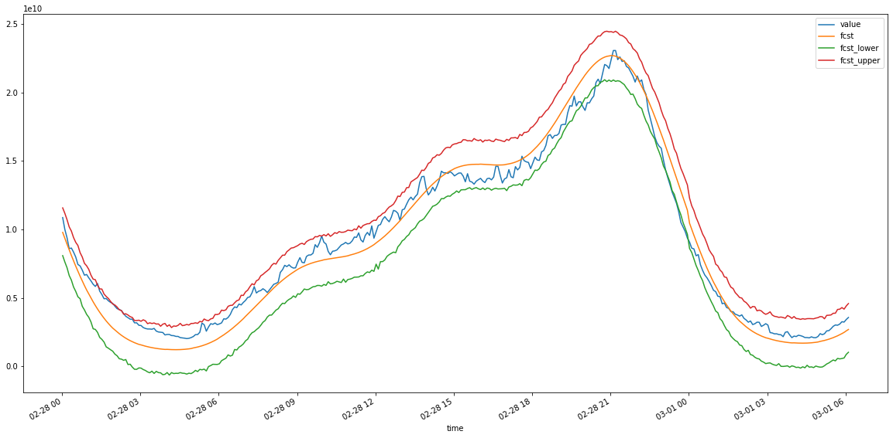
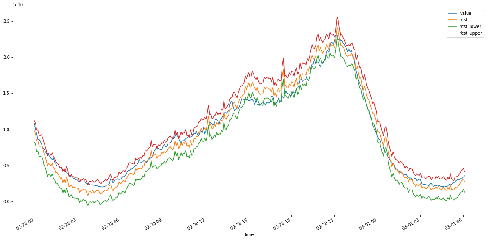

# Proyecto de predicción de series temporales utilizando Machine Learning

Autor: Antonio Jesús Acosta López

Fecha: 20/05/2022

## Contexto
El objetivo de este proyecto es analizar los datos de red procedentes de un dispositivo *BRAS (Broadband Remote Access Server)* y utilizar ***Machine Learning*** poder realizar predicciones de su tráfico futuro, con idea de anticipar medidas de *capacity planning* a los elementos dependientes de dicho tráfico.

En concreto, una empresa colaboradora ha proporcionado un fichero ***raw_data.csv*** que contiene el tráfico del dispositivo medido en intervalos, a priori, de **5 minutos**.

Además de las librerías típicas utilizadas para el análisis de datos, como *NumPy* o *Pandas*, para este proyecto se utilizará la librería [***Kats***](https://github.com/facebookresearch/Kats), destinada específicamente a analizar y predecir datasets con series temporales.

De la reunión inicial mantenida con la empresa se acuerda que, del conjunto de *features* del dataset, la variable target es ***traffic_out***.

## Análisis previo

Como primer paso, empezados instalando la librería *Kats*:


```python
!pip install kats
```

    Collecting kats
      Downloading kats-0.2.0-py3-none-any.whl (612 kB)
         |████████████████████████████████| 612 kB 8.3 MB/s 
    [?25hRequirement already satisfied: fbprophet==0.7.1 in /usr/local/lib/python3.7/dist-packages (from kats) (0.7.1)
    Requirement already satisfied: holidays>=0.10.2 in /usr/local/lib/python3.7/dist-packages (from kats) (0.10.5.2)
    Requirement already satisfied: importlib-metadata in /usr/local/lib/python3.7/dist-packages (from kats) (4.11.3)
    Collecting statsmodels==0.12.2
      Downloading statsmodels-0.12.2-cp37-cp37m-manylinux1_x86_64.whl (9.5 MB)
         |████████████████████████████████| 9.5 MB 60.5 MB/s 
    [?25hCollecting parameterized>=0.8.1
      Downloading parameterized-0.8.1-py2.py3-none-any.whl (26 kB)
    Requirement already satisfied: attrs>=21.2.0 in /usr/local/lib/python3.7/dist-packages (from kats) (21.4.0)
    Requirement already satisfied: matplotlib>=2.0.0 in /usr/local/lib/python3.7/dist-packages (from kats) (3.2.2)
    Collecting deprecated>=1.2.12
      Downloading Deprecated-1.2.13-py2.py3-none-any.whl (9.6 kB)
    Requirement already satisfied: torch in /usr/local/lib/python3.7/dist-packages (from kats) (1.11.0+cu113)
    Requirement already satisfied: setuptools-git>=1.2 in /usr/local/lib/python3.7/dist-packages (from kats) (1.2)
    Collecting pymannkendall>=1.4.1
      Downloading pymannkendall-1.4.2-py3-none-any.whl (12 kB)
    Requirement already satisfied: scikit-learn>=0.24.2 in /usr/local/lib/python3.7/dist-packages (from kats) (1.0.2)
    Collecting gpytorch
      Downloading gpytorch-1.6.0.tar.gz (310 kB)
         |████████████████████████████████| 310 kB 66.7 MB/s 
    [?25hRequirement already satisfied: scipy<1.8.0 in /usr/local/lib/python3.7/dist-packages (from kats) (1.4.1)
    Collecting numba>=0.52.0
      Downloading numba-0.55.1-1-cp37-cp37m-manylinux2014_x86_64.manylinux_2_17_x86_64.whl (3.3 MB)
         |████████████████████████████████| 3.3 MB 38.7 MB/s 
    [?25hRequirement already satisfied: numpy<1.22,>=1.21 in /usr/local/lib/python3.7/dist-packages (from kats) (1.21.6)
    Requirement already satisfied: tqdm>=4.36.1 in /usr/local/lib/python3.7/dist-packages (from kats) (4.64.0)
    Requirement already satisfied: pandas<=1.3.5,>=1.0.4 in /usr/local/lib/python3.7/dist-packages (from kats) (1.3.5)
    Requirement already satisfied: LunarCalendar>=0.0.9 in /usr/local/lib/python3.7/dist-packages (from kats) (0.0.9)
    Requirement already satisfied: seaborn>=0.11.1 in /usr/local/lib/python3.7/dist-packages (from kats) (0.11.2)
    Requirement already satisfied: plotly>=2.2.1 in /usr/local/lib/python3.7/dist-packages (from kats) (5.5.0)
    Collecting pytest-mpl>=0.12
      Downloading pytest_mpl-0.15.1-py3-none-any.whl (28 kB)
    Requirement already satisfied: python-dateutil>=2.8.0 in /usr/local/lib/python3.7/dist-packages (from kats) (2.8.2)
    Collecting ax-platform==0.2.4
      Downloading ax_platform-0.2.4-py3-none-any.whl (950 kB)
         |████████████████████████████████| 950 kB 55.1 MB/s 
    [?25hRequirement already satisfied: pystan==2.19.1.1 in /usr/local/lib/python3.7/dist-packages (from kats) (2.19.1.1)
    Requirement already satisfied: typing-extensions in /usr/local/lib/python3.7/dist-packages (from kats) (4.2.0)
    Requirement already satisfied: typeguard in /usr/local/lib/python3.7/dist-packages (from ax-platform==0.2.4->kats) (2.7.1)
    Collecting botorch==0.6.2
      Downloading botorch-0.6.2-py3-none-any.whl (347 kB)
         |████████████████████████████████| 347 kB 69.1 MB/s 
    [?25hRequirement already satisfied: jinja2 in /usr/local/lib/python3.7/dist-packages (from ax-platform==0.2.4->kats) (2.11.3)
    Collecting multipledispatch
      Downloading multipledispatch-0.6.0-py3-none-any.whl (11 kB)
    Requirement already satisfied: Cython>=0.22 in /usr/local/lib/python3.7/dist-packages (from fbprophet==0.7.1->kats) (0.29.30)
    Requirement already satisfied: cmdstanpy==0.9.5 in /usr/local/lib/python3.7/dist-packages (from fbprophet==0.7.1->kats) (0.9.5)
    Requirement already satisfied: convertdate>=2.1.2 in /usr/local/lib/python3.7/dist-packages (from fbprophet==0.7.1->kats) (2.4.0)
    Requirement already satisfied: patsy>=0.5 in /usr/local/lib/python3.7/dist-packages (from statsmodels==0.12.2->kats) (0.5.2)
    Requirement already satisfied: pymeeus<=1,>=0.3.13 in /usr/local/lib/python3.7/dist-packages (from convertdate>=2.1.2->fbprophet==0.7.1->kats) (0.5.11)
    Requirement already satisfied: wrapt<2,>=1.10 in /usr/local/lib/python3.7/dist-packages (from deprecated>=1.2.12->kats) (1.14.1)
    Requirement already satisfied: six in /usr/local/lib/python3.7/dist-packages (from holidays>=0.10.2->kats) (1.15.0)
    Requirement already satisfied: hijri-converter in /usr/local/lib/python3.7/dist-packages (from holidays>=0.10.2->kats) (2.2.3)
    Requirement already satisfied: korean-lunar-calendar in /usr/local/lib/python3.7/dist-packages (from holidays>=0.10.2->kats) (0.2.1)
    Requirement already satisfied: ephem>=3.7.5.3 in /usr/local/lib/python3.7/dist-packages (from LunarCalendar>=0.0.9->kats) (4.1.3)
    Requirement already satisfied: pytz in /usr/local/lib/python3.7/dist-packages (from LunarCalendar>=0.0.9->kats) (2022.1)
    Requirement already satisfied: pyparsing!=2.0.4,!=2.1.2,!=2.1.6,>=2.0.1 in /usr/local/lib/python3.7/dist-packages (from matplotlib>=2.0.0->kats) (3.0.9)
    Requirement already satisfied: kiwisolver>=1.0.1 in /usr/local/lib/python3.7/dist-packages (from matplotlib>=2.0.0->kats) (1.4.2)
    Requirement already satisfied: cycler>=0.10 in /usr/local/lib/python3.7/dist-packages (from matplotlib>=2.0.0->kats) (0.11.0)
    Requirement already satisfied: setuptools in /usr/local/lib/python3.7/dist-packages (from numba>=0.52.0->kats) (57.4.0)
    Collecting llvmlite<0.39,>=0.38.0rc1
      Downloading llvmlite-0.38.1-cp37-cp37m-manylinux_2_17_x86_64.manylinux2014_x86_64.whl (34.5 MB)
         |████████████████████████████████| 34.5 MB 1.2 MB/s 
    [?25hRequirement already satisfied: tenacity>=6.2.0 in /usr/local/lib/python3.7/dist-packages (from plotly>=2.2.1->kats) (8.0.1)
    Requirement already satisfied: importlib-resources in /usr/local/lib/python3.7/dist-packages (from pytest-mpl>=0.12->kats) (5.7.1)
    Requirement already satisfied: packaging in /usr/local/lib/python3.7/dist-packages (from pytest-mpl>=0.12->kats) (21.3)
    Requirement already satisfied: pytest in /usr/local/lib/python3.7/dist-packages (from pytest-mpl>=0.12->kats) (3.6.4)
    Requirement already satisfied: joblib>=0.11 in /usr/local/lib/python3.7/dist-packages (from scikit-learn>=0.24.2->kats) (1.1.0)
    Requirement already satisfied: threadpoolctl>=2.0.0 in /usr/local/lib/python3.7/dist-packages (from scikit-learn>=0.24.2->kats) (3.1.0)
    Requirement already satisfied: zipp>=0.5 in /usr/local/lib/python3.7/dist-packages (from importlib-metadata->kats) (3.8.0)
    Requirement already satisfied: MarkupSafe>=0.23 in /usr/local/lib/python3.7/dist-packages (from jinja2->ax-platform==0.2.4->kats) (2.0.1)
    Requirement already satisfied: atomicwrites>=1.0 in /usr/local/lib/python3.7/dist-packages (from pytest->pytest-mpl>=0.12->kats) (1.4.0)
    Requirement already satisfied: pluggy<0.8,>=0.5 in /usr/local/lib/python3.7/dist-packages (from pytest->pytest-mpl>=0.12->kats) (0.7.1)
    Requirement already satisfied: more-itertools>=4.0.0 in /usr/local/lib/python3.7/dist-packages (from pytest->pytest-mpl>=0.12->kats) (8.13.0)
    Requirement already satisfied: py>=1.5.0 in /usr/local/lib/python3.7/dist-packages (from pytest->pytest-mpl>=0.12->kats) (1.11.0)
    Building wheels for collected packages: gpytorch
      Building wheel for gpytorch (setup.py) ... [?25l[?25hdone
      Created wheel for gpytorch: filename=gpytorch-1.6.0-py2.py3-none-any.whl size=509889 sha256=3ffba2522d2562d584d78b5e6bfb54dc4638335070a555f291383c2a07577290
      Stored in directory: /root/.cache/pip/wheels/66/b5/89/34c06ad393a6feb72b4cdde46d0f1c667f3e2632960f9df109
    Successfully built gpytorch
    Installing collected packages: multipledispatch, gpytorch, llvmlite, botorch, statsmodels, pytest-mpl, pymannkendall, parameterized, numba, deprecated, ax-platform, kats
      Attempting uninstall: llvmlite
        Found existing installation: llvmlite 0.34.0
        Uninstalling llvmlite-0.34.0:
          Successfully uninstalled llvmlite-0.34.0
      Attempting uninstall: statsmodels
        Found existing installation: statsmodels 0.10.2
        Uninstalling statsmodels-0.10.2:
          Successfully uninstalled statsmodels-0.10.2
      Attempting uninstall: numba
        Found existing installation: numba 0.51.2
        Uninstalling numba-0.51.2:
          Successfully uninstalled numba-0.51.2
    Successfully installed ax-platform-0.2.4 botorch-0.6.2 deprecated-1.2.13 gpytorch-1.6.0 kats-0.2.0 llvmlite-0.38.1 multipledispatch-0.6.0 numba-0.55.1 parameterized-0.8.1 pymannkendall-1.4.2 pytest-mpl-0.15.1 statsmodels-0.12.2


*Kats* contiene una clase denominada ***OutlierDetector*** que sirve para detectar automáticamente *outliers* en una serie temporal, simplificando enormemente el proceso. 

Sin embargo, [la clase no es compatible con datasets cuya serie temporal tiene una frecuencia inferior a 1 día](https://webcache.googleusercontent.com/search?q=cache:sT6mDkmLpIcJ:https://githubhot.com/repo/facebookresearch/Kats/issues/98+&cd=5&hl=es&ct=clnk&gl=es), como es nuestro caso (el dataset tiene una frecuencia de 5 en 5 minutos). Si llamamos al método ***detector*** de la clase con nuestro dataset, devolverá el error:


```
ValueError: freq T not understood. Please report if you think this in error.
```


Haciendo una trazabilidad del error, podemos averiguar que su origen se encuentra en el uso interno del método ***freq_to_period*** de la clase ***tsatools***, la cual, a día de hoy, no identifica frecuencias temporales expresadas en minutos (identificadas como ***T*** ):

[https://www.statsmodels.org/stable/_modules/statsmodels/tsa/tsatools.html](https://www.statsmodels.org/stable/_modules/statsmodels/tsa/tsatools.html)

Aprovechando la capacidad de Python para la sobrecarga de funciones, vamos a re-implementar, para nuestro caso concreto, el método *freq_to_period* mencionado para que soporte nuestra periodicidad:


```python
from statsmodels.tsa import tsatools # Importación de la clase a modificar
from pandas.tseries import offsets
from pandas.tseries.frequencies import to_offset

def freq_to_period_new(freq): # Definición del nuevo método

    # Implementación original:
    """
    Convert a pandas frequency to a periodicity

    Parameters
    ----------
    freq : str or offset
    Frequency to convert

    Returns
    -------
    period : int
    Periodicity of freq

    Notes
    -----
    Annual maps to 1, quarterly maps to 4, monthly to 12, weekly to 52.
    """
    if not isinstance(freq, offsets.DateOffset) and freq not in ['T','5T']: # Modificado
        freq = to_offset(freq)  # go ahead and standardize
    
    if freq not in ['T','5T']: # Modificado
      freq = freq.rule_code.upper()

    if freq == "A" or freq.startswith(("A-", "AS-")):
        return 1
    elif freq == "Q" or freq.startswith(("Q-", "QS-")):
        return 4
    elif freq == "M" or freq.startswith(("M-", "MS")):
        return 12
    elif freq == "W" or freq.startswith("W-"):
        return 52
    elif freq == "D":
        return 7
    elif freq == "B":
        return 5
    elif freq == "H":
        return 24
    # Añadido
    elif freq == '5T': # Frecuencia de 5 en 5 minutos
        return 5
    elif freq == 'T': # Frecuencia base de minuto
        return 1
    # Fin añadido
    else:  # pragma : no cover
        raise ValueError(
            "freq {} not understood. Please report if you "
            "think this is in error.".format(freq)
        )

# Reemplazo de método en la clase:
tsatools.__dict__["freq_to_period"] = freq_to_period_new
tsatools.freq_to_period = freq_to_period_new
```

Una vez modificado el método original, podemos realizar el resto de importaciones de las dependencias, que ya harán uso de nuestro método *freq_to_period* personalizado:


```python
# Importación de dependencias

import numpy as np
import pandas as pd
from datetime import datetime, timedelta
import matplotlib.pyplot as plt
import sys
import warnings
warnings.filterwarnings('ignore')

from kats.consts import ModelEnum, SearchMethodEnum, TimeSeriesData
from kats.models.sarima import SARIMAModel, SARIMAParams
from kats.models.prophet import ProphetModel, ProphetParams
from kats.detectors.hourly_ratio_detection import HourlyRatioDetector
import kats.utils.time_series_parameter_tuning as tpt
from kats.tsfeatures.tsfeatures import TsFeatures
from kats.detectors.outlier import OutlierDetector

from statsmodels.tsa.seasonal import seasonal_decompose
from statsmodels.tsa.stattools import adfuller
from kats.models.metalearner.get_metadata import GetMetaData
```

A continuación procedemos a importar nuestro fichero csv que contiene el dataset tal cual se recibió:


```python
# Importación del dataset raw_data.csv
df = pd.read_csv('/content/raw_data.csv')

df.head()
```


  <div id="df-958b422f-c089-4a03-8f03-7c365931e6d8">
    <div class="colab-df-container">
      <div>

<table border="1" class="dataframe">
  <thead>
    <tr style="text-align: right;">
      <th></th>
      <th>date</th>
      <th>timestamp</th>
      <th>id</th>
      <th>measurement_name</th>
      <th>host</th>
      <th>interface</th>
      <th>description</th>
      <th>traffic_out</th>
      <th>traffic_in</th>
    </tr>
  </thead>
  <tbody>
    <tr>
      <th>0</th>
      <td>Feb 22, 2022 @ 06:16:33.000</td>
      <td>1645510593</td>
      <td>d5f46571fd43f1c5eb3ffbf02412e8230b674510cbde48...</td>
      <td>traffic_ftth_in</td>
      <td>host1</td>
      <td>in_ae20</td>
      <td>Trafico de los interfaces</td>
      <td>NaN</td>
      <td>471296000.0</td>
    </tr>
    <tr>
      <th>1</th>
      <td>Feb 22, 2022 @ 06:16:33.000</td>
      <td>1645510593</td>
      <td>e77a8ca1ae6bf4561ae2c4fe1bb95eb113cfe058b4d00f...</td>
      <td>traffic_ftth_out</td>
      <td>host1</td>
      <td>out_ae20</td>
      <td>Trafico de los interfaces</td>
      <td>4.051390e+09</td>
      <td>NaN</td>
    </tr>
    <tr>
      <th>2</th>
      <td>Feb 22, 2022 @ 06:21:33.000</td>
      <td>1645510893</td>
      <td>112cf270c52350002022e8a5c4f940c88a16f7016e2c65...</td>
      <td>traffic_ftth_in</td>
      <td>host1</td>
      <td>in_ae20</td>
      <td>Trafico de los interfaces</td>
      <td>NaN</td>
      <td>526275000.0</td>
    </tr>
    <tr>
      <th>3</th>
      <td>Feb 22, 2022 @ 06:21:33.000</td>
      <td>1645510893</td>
      <td>92b549b653a106a485257252c6e4982cb8206ce9dc3d83...</td>
      <td>traffic_ftth_out</td>
      <td>host1</td>
      <td>out_ae20</td>
      <td>Trafico de los interfaces</td>
      <td>4.434980e+09</td>
      <td>NaN</td>
    </tr>
    <tr>
      <th>4</th>
      <td>Feb 22, 2022 @ 06:26:33.000</td>
      <td>1645511193</td>
      <td>81eb26b06aa1d2d47f80a5dcac582b322cb7b8f6b4bb6a...</td>
      <td>traffic_ftth_in</td>
      <td>host1</td>
      <td>in_ae20</td>
      <td>Trafico de los interfaces</td>
      <td>NaN</td>
      <td>655803000.0</td>
    </tr>
  </tbody>
</table>
</div>
      

  
  </div>


Como se ha comentado anteriormente, de la reunión inicial se definió que la variable objetivo es ***traffic_out***.

Sabiendo esto, vamos a echar un vistazo al resto de variables del dataset para identificar si pueden aportarnos valor para la predicción:


```python
df.describe()
```


  <div id="df-a94a8bb5-b9bb-4e54-817a-395952120a55">
    <div class="colab-df-container">
      <div>

<table border="1" class="dataframe">
  <thead>
    <tr style="text-align: right;">
      <th></th>
      <th>time</th>
      <th>value</th>
      <th>traffic_in</th>
    </tr>
  </thead>
  <tbody>
    <tr>
      <th>count</th>
      <td>4.030000e+03</td>
      <td>2.015000e+03</td>
      <td>2.015000e+03</td>
    </tr>
    <tr>
      <th>mean</th>
      <td>1.645813e+09</td>
      <td>1.096045e+10</td>
      <td>1.041467e+09</td>
    </tr>
    <tr>
      <th>std</th>
      <td>1.745258e+05</td>
      <td>6.316424e+09</td>
      <td>4.092599e+08</td>
    </tr>
    <tr>
      <th>min</th>
      <td>1.645511e+09</td>
      <td>2.006510e+09</td>
      <td>3.811150e+08</td>
    </tr>
    <tr>
      <th>25%</th>
      <td>1.645662e+09</td>
      <td>5.444890e+09</td>
      <td>6.803090e+08</td>
    </tr>
    <tr>
      <th>50%</th>
      <td>1.645813e+09</td>
      <td>1.075560e+10</td>
      <td>1.012550e+09</td>
    </tr>
    <tr>
      <th>75%</th>
      <td>1.645964e+09</td>
      <td>1.572100e+10</td>
      <td>1.337840e+09</td>
    </tr>
    <tr>
      <th>max</th>
      <td>1.646115e+09</td>
      <td>2.597570e+10</td>
      <td>2.298080e+09</td>
    </tr>
  </tbody>
</table>
</div>
      
    
  </div>


```python
df.nunique() # Extracción de valores únicos, por columnas
```


    date                2015
    time                2015
    id                  4030
    measurement_name       2
    host                   1
    interface              2
    description            1
    value               2012
    traffic_in          2009
    dtype: int64


Como se puede ver de la sentencia anterior, las variables categóricas no aportan valor aprovechable, ya que *id* es un valor único por cada fila y el resto o también tienen 1 único valor para todas las filas o 1 por cada variable *traffic*.

Por ello, para realizar nuestro estudio y predicción, nos quedaremos con las variables ***timestamp*** y ***traffic_out***. La variable *date* y *timestamp* son equivalentes, así que se elige arbitrariamente ***timestamp*** para realizarle más adelante una transformación de formato, a modo ilustrativo, usando *TimeSeriesData*.


```python
# Creación de nuevo dataset con las columnas seleccionadas en el estudio previo
data = df[['timestamp','traffic_out']].copy()
data.dropna(inplace=True) # Eliminación de filas NA (filas para traffic_in)
data.columns = ['time','value'] # Renombrado de columnas
data.head()
```


  <div id="df-fbca135b-ee0f-4afe-945e-78a8cbdb62d2">
    <div class="colab-df-container">
      <div>

<table border="1" class="dataframe">
  <thead>
    <tr style="text-align: right;">
      <th></th>
      <th>time</th>
      <th>value</th>
    </tr>
  </thead>
  <tbody>
    <tr>
      <th>1</th>
      <td>1645510593</td>
      <td>4.051390e+09</td>
    </tr>
    <tr>
      <th>3</th>
      <td>1645510893</td>
      <td>4.434980e+09</td>
    </tr>
    <tr>
      <th>5</th>
      <td>1645511193</td>
      <td>4.686640e+09</td>
    </tr>
    <tr>
      <th>7</th>
      <td>1645511493</td>
      <td>4.646820e+09</td>
    </tr>
    <tr>
      <th>9</th>
      <td>1645511793</td>
      <td>4.813480e+09</td>
    </tr>
  </tbody>
</table>
</div>
      
  
  </div>


A continuación vamos a convertir el dataframe generado en un objeto de la clase ***TimeSeriesData*** de la librería *Kats*. En la llamada al constructor de la clase, además, le pasamos los parámetros que nos permiten convertir el *timestamp* a un formato fecha/hora legible:


```python
# Conversión del dataframe en un TimeSeriesData
ts_data = TimeSeriesData(
        time=data['time'], 
        value=data['value'], 
        use_unix_time=True, # Conversión de timestamp a date
        unix_time_units="s"
)

ts_df = ts_data.to_dataframe().set_index('time') # Creación de dataframe a usar en varias partes

ts_data
```


<div>

<table border="1" class="dataframe">
  <thead>
    <tr style="text-align: right;">
      <th></th>
      <th>time</th>
      <th>value</th>
    </tr>
  </thead>
  <tbody>
    <tr>
      <th>0</th>
      <td>2022-02-22 06:16:33</td>
      <td>4.051390e+09</td>
    </tr>
    <tr>
      <th>1</th>
      <td>2022-02-22 06:21:33</td>
      <td>4.434980e+09</td>
    </tr>
    <tr>
      <th>2</th>
      <td>2022-02-22 06:26:33</td>
      <td>4.686640e+09</td>
    </tr>
    <tr>
      <th>3</th>
      <td>2022-02-22 06:31:33</td>
      <td>4.646820e+09</td>
    </tr>
    <tr>
      <th>4</th>
      <td>2022-02-22 06:36:33</td>
      <td>4.813480e+09</td>
    </tr>
    <tr>
      <th>...</th>
      <td>...</td>
      <td>...</td>
    </tr>
    <tr>
      <th>2010</th>
      <td>2022-03-01 05:46:33</td>
      <td>3.096660e+09</td>
    </tr>
    <tr>
      <th>2011</th>
      <td>2022-03-01 05:51:33</td>
      <td>3.268320e+09</td>
    </tr>
    <tr>
      <th>2012</th>
      <td>2022-03-01 05:56:33</td>
      <td>3.240970e+09</td>
    </tr>
    <tr>
      <th>2013</th>
      <td>2022-03-01 06:01:33</td>
      <td>3.430270e+09</td>
    </tr>
    <tr>
      <th>2014</th>
      <td>2022-03-01 06:06:33</td>
      <td>3.579160e+09</td>
    </tr>
  </tbody>
</table>
<p>2015 rows × 2 columns</p>


En la celda anterior hemos creado también un dataframe de *Pandas* con las conversiones de fecha ya realizadas, y además con la serie temporal establecida como índice. Nos será necesario en posteriores operaciones que solo admiten *DataFrame*.

Una vez obtenido nuestro objeto *TimeSeriesData*, vamos a inspeccionar visualmente nuestros datos:


```python
# Inspección visual
ts_data.plot(cols=['value'])
plt.show()
```


    

    


A primera vista podemos apreciar una cierta estacionalidad diaria en los datos, pero vamos a profundizar en el análisis del dataset para sacar mejores conclusiones.

Antes que nada, vamos a asegurarnos de que no hay ningún dato faltante:


```python
# Data missing
ts_data.is_data_missing()
```


    False


Como demostración de las capacidades de análisis de Kats, vamos a comprobar también que nuestra serie temporal es *univariate*, es decir, que contiene una sola observación (en nuestro caso, la variable target *traffic_out*) para cada marca temporal. Para ello, usamos el método ***is_univariate*** de la clase *TimeSeriesData*:


```python
# Comprobación de observaciones
ts_data.is_univariate()
```


    True


Podemos también comprobar la frecuencia que, desde *Pandas*, se *infiere* de nuestro dataset, para confirmar que efectivamente se detecta que las mediciones son de 5 en 5 minutos:


```python
freq = pd.infer_freq(ts_df.index)
print(freq)
```

    5T


Ahora vamos a *descomponer* la serie temporal en gráficas con sus principales características. Para ello, usamos la función ***seasonal_decompose*** de la librería *statsmodels*, en la que también se basa *Kats*.

Primero, haremos la descomposición utilizando un modelo *aditivo*:


```python
# Pintado de tendencia, estacionalidad y ruido. Modelo aditivo
# Frecuencia de 288 porque es el nº de 5 minutos en 1 día
result = seasonal_decompose(ts_df, model='additive', freq=288)
fig = result.plot();
fig.set_size_inches((16,9))
plt.show()
```


    

    


Y a continuación hacemos lo propio para un modelo *multiplicativo*:


```python
# Pintado de tendencia, estacionalidad y ruido. Modelo multiplicativo

result = seasonal_decompose(ts_df, model='multiplicative', freq=288)
fig = result.plot();
fig.set_size_inches((16,9))
plt.show()
```


    

    


Como podemos ver, no hay grandes diferencias entre hacer la descomposición con un modelo aditivo o uno multiplicativo. Para ambos casos se ha utilizado como frecuencia el valor 288, que es el número de 5 minutos que compone un día.

Se puede apreciar que el dataset tiene una cierta **tendencia**, que dirige hacia arriba su pendiente a partir del 25/02/2022 y llega a su máximo el día 27/02/2022, para empezar desde entonces una tendencia descendente. Esto sería coherente con el pico máximo que alcanza los valores del dataset para el día 27/02/2022, tal y como se ve en la gráfica del principio.

Igualmente, en las descomposiciones puede verse una **estacionalidad** clara que se repite diariamente.

En cuanto al **ruido**, en ambos casos se detectan valores residuales a lo largo de todo el dataset, posiblemente debido a las continuas subidas y bajadas en los valores medidos.


A continuación vamos a calcular la autocorrelación en la serie temporal, que para un valor dado nos da una medida de cuanto y cuantos valores anteriores *influyen* en él:


```python
from statsmodels.graphics.tsaplots import plot_pacf
from statsmodels.graphics.tsaplots import plot_acf

# Visualizamos las autocorrelaciones (para definir la ventana de observacion)
fig, ax = plt.subplots(2,1,figsize=(20,10))
plot_acf(ts_df, lags=100, ax=ax[0])
plot_pacf(ts_df, lags=100, ax=ax[1])
plt.show()
```


    

    


Según la gráfica de autocorrelación, podemos considerar en torno a **40 valores** como ventana de observación para futuras operaciones; puede apreciarse, además, que al final de la gráfica hay una autocorrelación negativa, que posiblemente continuaría aumentando si pintásemos más de 100 valores. La autocorrelación de los 20 primeros valores es bastante alta, debido seguramente a la frecuencia relativamente pequeña en la que se ejecutan las mediciones.

En la autocorrelación parcial, solo hay 1 valor que influye significativamente en el medido.

A continuación, y aunque ya hemos visto que nuestra serie temporal tiene tendencia, vamos a realizar la prueba de [***Dickey-Fuller aumentada***](https://es.wikipedia.org/wiki/Prueba_de_Dickey-Fuller_aumentada) para determinar si es o no *estacionaria*. Si el valor *p* de esta prueba da un número inferior a 0.05, la serie temporal es considerada estacionaria:


```python
# Estacionariedad
adf_test = adfuller(ts_df)
adf_test
print("Valor de p: ", adf_test[1]) # Si el valor es menor que 0.05, hay estacionariedad
```

    Valor de p:  8.384108323116558e-07


Como podemos observar, el test *adf* nos da efectivamente un valor inferior a 0.05, lo que sugiere que la serie temporal es estacionaria.

Sin embargo, como hemos podido ver en la descomposición temporal, el dataset tiene tendencia, por lo que **el test no resulta concluyente**.

Por otro lado, podemos usar la clase ***TsFeatures*** para extraer estadísticas más específicas de nuestra serie temporal, utilizando para ello como *windows_size* el valor 40 extraído de la gráfica de autocorrelación:


```python
# Obtención de estadísticas temporales del dataset
features_extractor = TsFeatures(window_size = 40) # Extraído de autocorrelación

output_features = features_extractor.transform(ts_data)

output_features
```


    {'binarize_mean': 0.49280397022332506,
     'crossing_points': 26,
     'diff1y_acf1': 0.1532649436097685,
     'diff1y_acf5': 0.18688024701889908,
     'diff1y_pacf5': 0.11887951847646995,
     'diff2y_acf1': -0.5139803148302929,
     'diff2y_acf5': 0.2650406685457476,
     'diff2y_pacf5': 0.5586190057048327,
     'entropy': 0.14826045658022866,
     'firstmin_ac': 140,
     'firstzero_ac': 64,
     'flat_spots': 1,
     'heterogeneity': 1994.8727842934795,
     'histogram_mode': 2006510000.0,
     'holt_alpha': 0.9242857142857143,
     'holt_beta': 0.1127177700348432,
     'hurst': 0.8367425361680472,
     'hw_alpha': 0.9246945659658422,
     'hw_beta': 0.10218903122699255,
     'hw_gamma': 0.010699827149081936,
     'length': 2015,
     'level_shift_idx': 472,
     'level_shift_size': 475260000.0,
     'linearity': 0.009299665402982384,
     'lumpiness': 5.095243454199511e+37,
     'mean': 10960449151.364765,
     'peak': 2,
     'seas_acf1': 0.9669722793099192,
     'seas_pacf1': -0.13400499025197593,
     'seasonality_strength': 0.3224668274014938,
     'spikiness': 2.609985782720197e+27,
     'stability': 3.5371132905689588e+19,
     'std1st_der': 299326489.65092766,
     'trend_strength': 0.9986687895439853,
     'trough': 0,
     'unitroot_kpss': 0.7312170358584738,
     'var': 3.987741093432089e+19,
     'y_acf1': 0.9974171086802507,
     'y_acf5': 4.897404450132813,
     'y_pacf5': 1.084633547167978}


De entre todas las estadísticas extraídas cabe destacar ***entropy***, que en nuestro caso es del 14,8%. A menor valor en esta estadística (que podemos decir que mide algo así como la *aleatoriedad* de nuestros datos), mayor capacidad de predicción tendremos.

También podemos señalar el valor de la estadística *mean*, que es el ***nivel*** de nuestra serie temporal.

Además de todo lo anterior, *Kats* nos proporciona la clase ***OutlierDetector*** mencionada al principio, que nos detecta de una forma automática los *outliers* de nuestro conjunto de datos.

Vamos a realizar una extracción de los valores anómalos que detecta la clase:


```python
ts_outlierDetection = OutlierDetector(ts_data, 'multiplicative')
ts_outlierDetection.detector() # Detección de outliers
ts_outlierDetection.outliers[0] # Visualización
```


    [Timestamp('2022-02-23 17:41:33'),
     Timestamp('2022-02-23 17:51:33'),
     Timestamp('2022-02-23 20:36:33'),
     Timestamp('2022-02-25 14:46:33'),
     Timestamp('2022-02-25 19:06:33'),
     Timestamp('2022-02-26 11:06:33'),
     Timestamp('2022-02-27 11:01:33'),
     Timestamp('2022-02-27 15:51:33')]


Vemos que la clase anterior nos ha detectado varios *outliers*; para facilitar su identificación, vamos a pintarlos sobre el gráfico anterior para visualizar donde están ubicados:


```python
ts_data_df = ts_data.to_dataframe() # Conversión de serie temporal en DataFrame

# Conversión de lista de outliers (solo fechas) en dataframe,
# extrayendo los valores asociados de ts_data_df
ts_outliers = pd.DataFrame({
                            'time': ts_outlierDetection.outliers[0],
                            'value': ts_data_df[ts_data_df['time'].isin(ts_outlierDetection.outliers[0])]['value']
                          })

plt.figure(figsize=(20, 10))

ax = plt.axes()
ax.scatter(ts_outliers['time'], ts_outliers['value'], c='red') # Outliers

plt.plot(ts_data_df['time'], ts_data_df['value']) # Serie temporal
```


    [<matplotlib.lines.Line2D at 0x7f321492bcd0>]


    

    


Con la empresa se acuerda que estos valores no serán eliminados para el desarrollo del modelo predictivo.

## Búsqueda del mejor modelo predictivo


A continuación vamos a buscar el modelo que mejor se ajusta a nuestro dataset, para hacer predicciones a futuro del tráfico de la red.

Para ello, como es indispensable, vamos a dividir nuestra serie temporal entre un conjunto de datos y un conjunto de test. Para ello, se soma de referencia el día 28/02/2022, tal y como recomendó la empresa:


```python
# División en conjunto de entrenamiento y de test
ts_train_data = ts_data[ts_data.time < np.datetime64('2022-02-28')]
ts_test_data = ts_data[ts_data.time >= np.datetime64('2022-02-28')]
```

Podemos pintar el dataset dividido, para verificar que hemos hecho la partición correctamente:


```python
ts_test_data.plot()
ts_test_data
```


<div>

<table border="1" class="dataframe">
  <thead>
    <tr style="text-align: right;">
      <th></th>
      <th>time</th>
      <th>value</th>
    </tr>
  </thead>
  <tbody>
    <tr>
      <th>0</th>
      <td>2022-02-28 00:01:33</td>
      <td>1.087050e+10</td>
    </tr>
    <tr>
      <th>1</th>
      <td>2022-02-28 00:06:33</td>
      <td>9.999490e+09</td>
    </tr>
    <tr>
      <th>2</th>
      <td>2022-02-28 00:11:33</td>
      <td>9.395300e+09</td>
    </tr>
    <tr>
      <th>3</th>
      <td>2022-02-28 00:16:33</td>
      <td>8.602720e+09</td>
    </tr>
    <tr>
      <th>4</th>
      <td>2022-02-28 00:21:33</td>
      <td>8.644660e+09</td>
    </tr>
    <tr>
      <th>...</th>
      <td>...</td>
      <td>...</td>
    </tr>
    <tr>
      <th>357</th>
      <td>2022-03-01 05:46:33</td>
      <td>3.096660e+09</td>
    </tr>
    <tr>
      <th>358</th>
      <td>2022-03-01 05:51:33</td>
      <td>3.268320e+09</td>
    </tr>
    <tr>
      <th>359</th>
      <td>2022-03-01 05:56:33</td>
      <td>3.240970e+09</td>
    </tr>
    <tr>
      <th>360</th>
      <td>2022-03-01 06:01:33</td>
      <td>3.430270e+09</td>
    </tr>
    <tr>
      <th>361</th>
      <td>2022-03-01 06:06:33</td>
      <td>3.579160e+09</td>
    </tr>
  </tbody>
</table>
<p>362 rows × 2 columns</p>


    

    


```python
ts_train_data.plot()
ts_train_data
```


<div>

<table border="1" class="dataframe">
  <thead>
    <tr style="text-align: right;">
      <th></th>
      <th>time</th>
      <th>value</th>
    </tr>
  </thead>
  <tbody>
    <tr>
      <th>0</th>
      <td>2022-02-22 06:16:33</td>
      <td>4.051390e+09</td>
    </tr>
    <tr>
      <th>1</th>
      <td>2022-02-22 06:21:33</td>
      <td>4.434980e+09</td>
    </tr>
    <tr>
      <th>2</th>
      <td>2022-02-22 06:26:33</td>
      <td>4.686640e+09</td>
    </tr>
    <tr>
      <th>3</th>
      <td>2022-02-22 06:31:33</td>
      <td>4.646820e+09</td>
    </tr>
    <tr>
      <th>4</th>
      <td>2022-02-22 06:36:33</td>
      <td>4.813480e+09</td>
    </tr>
    <tr>
      <th>...</th>
      <td>...</td>
      <td>...</td>
    </tr>
    <tr>
      <th>1648</th>
      <td>2022-02-27 23:36:33</td>
      <td>1.297520e+10</td>
    </tr>
    <tr>
      <th>1649</th>
      <td>2022-02-27 23:41:33</td>
      <td>1.292090e+10</td>
    </tr>
    <tr>
      <th>1650</th>
      <td>2022-02-27 23:46:33</td>
      <td>1.211650e+10</td>
    </tr>
    <tr>
      <th>1651</th>
      <td>2022-02-27 23:51:33</td>
      <td>1.169430e+10</td>
    </tr>
    <tr>
      <th>1652</th>
      <td>2022-02-27 23:56:33</td>
      <td>1.114790e+10</td>
    </tr>
  </tbody>
</table>
<p>1653 rows × 2 columns</p>


    

    


Utilizando la capacidad de extracción de metadatos de *Kats*, vamos a realizar la búsqueda del mejor modelo para nuestro *time series*.

Para ello, empezamos extrayendo sus metadatos con la clase ***GetMetaData***:


```python
MD = GetMetaData(data=ts_data) # Instanciación de extractor de metadatos para el dataset
```

Y comprobamos los modelos entre los que vamos a poder buscar:


```python
MD.all_models
```


    {'arima': kats.models.arima.ARIMAModel,
     'holtwinters': kats.models.holtwinters.HoltWintersModel,
     'prophet': kats.models.prophet.ProphetModel,
     'sarima': kats.models.sarima.SARIMAModel,
     'stlf': kats.models.stlf.STLFModel,
     'theta': kats.models.theta.ThetaModel}


Lanzamos la comprobación de modelos con el método *tune_executor* de la clase *GetMetaData*, que internamente realizará un *random_search* con los distintos modelos y extraerá, para cada uno, su margen de error y los hiperparámetros utilizados:


```python
tested_models = MD.tune_executor()
```

    WARNING:root:Seasonal Decompose cannot handle sub day level granularity.
                        Please consider setting period yourself based on the input data.
                        Defaulting to a period of 2.
    WARNING:root:Seasonal Decompose cannot handle sub day level granularity.
                        Please consider setting period yourself based on the input data.
                        Defaulting to a period of 2.
    WARNING:root:Seasonal Decompose cannot handle sub day level granularity.
                        Please consider setting period yourself based on the input data.
                        Defaulting to a period of 2.
    WARNING:root:Seasonal Decompose cannot handle sub day level granularity.
                        Please consider setting period yourself based on the input data.
                        Defaulting to a period of 2.
    WARNING:root:Seasonal Decompose cannot handle sub day level granularity.
                        Please consider setting period yourself based on the input data.
                        Defaulting to a period of 2.
    WARNING:root:Seasonal Decompose cannot handle sub day level granularity.
                        Please consider setting period yourself based on the input data.
                        Defaulting to a period of 2.
    WARNING:root:Seasonal Decompose cannot handle sub day level granularity.
                        Please consider setting period yourself based on the input data.
                        Defaulting to a period of 2.
    WARNING:root:Seasonal Decompose cannot handle sub day level granularity.
                        Please consider setting period yourself based on the input data.
                        Defaulting to a period of 2.
    WARNING:root:Seasonal Decompose cannot handle sub day level granularity.
                        Please consider setting period yourself based on the input data.
                        Defaulting to a period of 2.
    WARNING:root:Seasonal Decompose cannot handle sub day level granularity.
                        Please consider setting period yourself based on the input data.
                        Defaulting to a period of 2.
    WARNING:root:Seasonal Decompose cannot handle sub day level granularity.
                        Please consider setting period yourself based on the input data.
                        Defaulting to a period of 2.
    WARNING:root:Seasonal Decompose cannot handle sub day level granularity.
                        Please consider setting period yourself based on the input data.
                        Defaulting to a period of 2.
    WARNING:root:Seasonal Decompose cannot handle sub day level granularity.
                        Please consider setting period yourself based on the input data.
                        Defaulting to a period of 2.
    WARNING:root:Seasonal Decompose cannot handle sub day level granularity.
                        Please consider setting period yourself based on the input data.
                        Defaulting to a period of 2.
    WARNING:root:Seasonal Decompose cannot handle sub day level granularity.
                        Please consider setting period yourself based on the input data.
                        Defaulting to a period of 2.
    WARNING:root:Seasonal Decompose cannot handle sub day level granularity.
                        Please consider setting period yourself based on the input data.
                        Defaulting to a period of 2.
    WARNING:root:Seasonal Decompose cannot handle sub day level granularity.
                        Please consider setting period yourself based on the input data.
                        Defaulting to a period of 2.
    WARNING:root:Seasonal Decompose cannot handle sub day level granularity.
                        Please consider setting period yourself based on the input data.
                        Defaulting to a period of 2.
    WARNING:root:Seasonal Decompose cannot handle sub day level granularity.
                        Please consider setting period yourself based on the input data.
                        Defaulting to a period of 2.
    WARNING:root:Seasonal Decompose cannot handle sub day level granularity.
                        Please consider setting period yourself based on the input data.
                        Defaulting to a period of 2.
    WARNING:root:Seasonal Decompose cannot handle sub day level granularity.
                        Please consider setting period yourself based on the input data.
                        Defaulting to a period of 2.
    WARNING:root:Seasonal Decompose cannot handle sub day level granularity.
                        Please consider setting period yourself based on the input data.
                        Defaulting to a period of 2.
    WARNING:root:Seasonal Decompose cannot handle sub day level granularity.
                        Please consider setting period yourself based on the input data.
                        Defaulting to a period of 2.
    WARNING:root:Seasonal Decompose cannot handle sub day level granularity.
                        Please consider setting period yourself based on the input data.
                        Defaulting to a period of 2.
    WARNING:root:Seasonal Decompose cannot handle sub day level granularity.
                        Please consider setting period yourself based on the input data.
                        Defaulting to a period of 2.
    WARNING:root:Seasonal Decompose cannot handle sub day level granularity.
                        Please consider setting period yourself based on the input data.
                        Defaulting to a period of 2.
    WARNING:root:Seasonal Decompose cannot handle sub day level granularity.
                        Please consider setting period yourself based on the input data.
                        Defaulting to a period of 2.
    WARNING:root:Seasonal Decompose cannot handle sub day level granularity.
                        Please consider setting period yourself based on the input data.
                        Defaulting to a period of 2.
    WARNING:root:Seasonal Decompose cannot handle sub day level granularity.
                        Please consider setting period yourself based on the input data.
                        Defaulting to a period of 2.
    WARNING:root:Seasonal Decompose cannot handle sub day level granularity.
                        Please consider setting period yourself based on the input data.
                        Defaulting to a period of 2.
    WARNING:root:Seasonal Decompose cannot handle sub day level granularity.
                        Please consider setting period yourself based on the input data.
                        Defaulting to a period of 2.
    WARNING:root:Seasonal Decompose cannot handle sub day level granularity.
                        Please consider setting period yourself based on the input data.
                        Defaulting to a period of 2.
    WARNING:root:Seasonal Decompose cannot handle sub day level granularity.
                        Please consider setting period yourself based on the input data.
                        Defaulting to a period of 2.
    WARNING:root:Seasonal Decompose cannot handle sub day level granularity.
                        Please consider setting period yourself based on the input data.
                        Defaulting to a period of 2.
    WARNING:root:Seasonal Decompose cannot handle sub day level granularity.
                        Please consider setting period yourself based on the input data.
                        Defaulting to a period of 2.
    WARNING:root:Seasonal Decompose cannot handle sub day level granularity.
                        Please consider setting period yourself based on the input data.
                        Defaulting to a period of 2.
    WARNING:root:Seasonal Decompose cannot handle sub day level granularity.
                        Please consider setting period yourself based on the input data.
                        Defaulting to a period of 2.
    WARNING:root:Seasonal Decompose cannot handle sub day level granularity.
                        Please consider setting period yourself based on the input data.
                        Defaulting to a period of 2.
    WARNING:root:Seasonal Decompose cannot handle sub day level granularity.
                        Please consider setting period yourself based on the input data.
                        Defaulting to a period of 2.


Finalizado el testeo con los distintos modelos, podemos mostrar por pantalla la información obtenida para cada uno:


```python
tested_models_df = pd.DataFrame(tested_models)
tested_models_df = tested_models_df.transpose()
tested_models_df.columns = ['Hyperparameters','MAE']
tested_models_df
```


  <div id="df-19cd6f34-464d-414a-8017-6a44d867f9a0">
    <div class="colab-df-container">
      <div>

<table border="1" class="dataframe">
  <thead>
    <tr style="text-align: right;">
      <th></th>
      <th>Hyperparameters</th>
      <th>MAE</th>
    </tr>
  </thead>
  <tbody>
    <tr>
      <th>arima</th>
      <td>{'p': 5, 'd': 1, 'q': 2}</td>
      <td>0.817616</td>
    </tr>
    <tr>
      <th>holtwinters</th>
      <td>{'damped': False, 'seasonal_periods': 30, 'tre...</td>
      <td>0.70729</td>
    </tr>
    <tr>
      <th>prophet</th>
      <td>{'seasonality_prior_scale': 4.6415888336127775...</td>
      <td>0.0445</td>
    </tr>
    <tr>
      <th>theta</th>
      <td>{'m': 6}</td>
      <td>0.598083</td>
    </tr>
    <tr>
      <th>stlf</th>
      <td>{'m': 10, 'method': 'prophet'}</td>
      <td>0.221551</td>
    </tr>
    <tr>
      <th>sarima</th>
      <td>{'p': 4, 'd': 1, 'q': 4, 'seasonal_order': '(1...</td>
      <td>0.399369</td>
    </tr>
  </tbody>
</table>
</div>
      
  
  </div>


Podemos ver que, para nuestro dataset, el modelo ***Prophet*** (el "estrella" de *Kats* y, presumiblemente, más preciso) es el que consigue predicciones con un menor error. Podemos visualizar todos los hiperparámetros seleccionados para utilizarlos de punto de partida:


```python
tested_models_df['Hyperparameters']['prophet']
```


    {'changepoint_prior_scale': 0.046415888336127774,
     'changepoint_range': 0.9500000000000002,
     'daily_seasonality': True,
     'seasonality_mode': 'multiplicative',
     'seasonality_prior_scale': 4.6415888336127775,
     'weekly_seasonality': False,
     'yearly_seasonality': True}


A continuación vamos a trabajar sobre *Prophet*.

## Baseline: predicción básica con ***Prophet***

Como baseline vamos a utilizar el modelo *Prophet* y el conjunto de hiperparámetros calculados de forma aleatoria por *Kats*.

Para instanciar el modelo, utilizamos las clases ***ProphetParams*** y ***ProphetModel***:


```python
# Entrenamiento con el modelo Prophet
params = ProphetParams(
    changepoint_prior_scale=0.046415888336127774,
    changepoint_range=0.9500000000000002,
    daily_seasonality=True,
    seasonality_mode='multiplicative',
    seasonality_prior_scale=4.6415888336127775,
    weekly_seasonality=False,
    yearly_seasonality=True
)

model = ProphetModel(ts_train_data, params)

model.fit() # Entrenamiento del modelo
```

Una vez entrenado nuestro nuevo modelo con *Prophet*, vamos a realizar la predicción, la cual dibujaremos para hacernos una idea de sus diferencias con respecto a los datos reales:


```python
# Predicción con Prophet
forecasting = model.predict(
  steps=len(ts_test_data), 
  freq="5T" # De 5 en 5 minutos
)

model.plot()
forecasting
```


  <div id="df-e1e0c704-7b6f-4c68-9696-77f17d27af1f">
    <div class="colab-df-container">
      <div>

<table border="1" class="dataframe">
  <thead>
    <tr style="text-align: right;">
      <th></th>
      <th>time</th>
      <th>fcst</th>
      <th>fcst_lower</th>
      <th>fcst_upper</th>
    </tr>
  </thead>
  <tbody>
    <tr>
      <th>0</th>
      <td>2022-02-28 00:01:33</td>
      <td>1.082765e+10</td>
      <td>9.780715e+09</td>
      <td>1.194965e+10</td>
    </tr>
    <tr>
      <th>1</th>
      <td>2022-02-28 00:06:33</td>
      <td>1.034668e+10</td>
      <td>9.232877e+09</td>
      <td>1.147014e+10</td>
    </tr>
    <tr>
      <th>2</th>
      <td>2022-02-28 00:11:33</td>
      <td>9.877457e+09</td>
      <td>8.780735e+09</td>
      <td>1.088951e+10</td>
    </tr>
    <tr>
      <th>3</th>
      <td>2022-02-28 00:16:33</td>
      <td>9.420801e+09</td>
      <td>8.338228e+09</td>
      <td>1.055025e+10</td>
    </tr>
    <tr>
      <th>4</th>
      <td>2022-02-28 00:21:33</td>
      <td>8.977434e+09</td>
      <td>7.882284e+09</td>
      <td>1.013558e+10</td>
    </tr>
    <tr>
      <th>...</th>
      <td>...</td>
      <td>...</td>
      <td>...</td>
      <td>...</td>
    </tr>
    <tr>
      <th>357</th>
      <td>2022-03-01 05:46:33</td>
      <td>-1.228540e+08</td>
      <td>-4.091797e+09</td>
      <td>3.826936e+09</td>
    </tr>
    <tr>
      <th>358</th>
      <td>2022-03-01 05:51:33</td>
      <td>-1.335031e+08</td>
      <td>-4.018110e+09</td>
      <td>3.653548e+09</td>
    </tr>
    <tr>
      <th>359</th>
      <td>2022-03-01 05:56:33</td>
      <td>-1.449259e+08</td>
      <td>-4.044273e+09</td>
      <td>3.919028e+09</td>
    </tr>
    <tr>
      <th>360</th>
      <td>2022-03-01 06:01:33</td>
      <td>-1.571785e+08</td>
      <td>-4.420491e+09</td>
      <td>4.085012e+09</td>
    </tr>
    <tr>
      <th>361</th>
      <td>2022-03-01 06:06:33</td>
      <td>-1.703149e+08</td>
      <td>-4.538561e+09</td>
      <td>4.238749e+09</td>
    </tr>
  </tbody>
</table>
<p>362 rows × 4 columns</p>
      
  
  </div>


    

    


E igualmente, dibujamos la predicción sobre los datos de test para poder comparar mejor los valores:


```python
# Comparación de predicción con datos originales
result = pd.concat([
                    ts_test_data.to_dataframe().set_index('time'),
                    forecasting.set_index('time')
                  ], axis=1)

result.plot(figsize=[20,10])
```


    <matplotlib.axes._subplots.AxesSubplot at 0x7f7edcdfe410>


    

    


Para dibujar el gráfico anterior hemos construido un dataframe llamado *result* que contiene los datos originales y la predicción:


```python
result
```


  <div id="df-252e5ae7-2bc4-4dd5-a712-06b1ff270319">
    <div class="colab-df-container">
      <div>

<table border="1" class="dataframe">
  <thead>
    <tr style="text-align: right;">
      <th></th>
      <th>value</th>
      <th>fcst</th>
      <th>fcst_lower</th>
      <th>fcst_upper</th>
    </tr>
    <tr>
      <th>time</th>
      <th></th>
      <th></th>
      <th></th>
      <th></th>
    </tr>
  </thead>
  <tbody>
    <tr>
      <th>2022-02-28 00:01:33</th>
      <td>1.087050e+10</td>
      <td>1.082765e+10</td>
      <td>9.780715e+09</td>
      <td>1.194965e+10</td>
    </tr>
    <tr>
      <th>2022-02-28 00:06:33</th>
      <td>9.999490e+09</td>
      <td>1.034668e+10</td>
      <td>9.232877e+09</td>
      <td>1.147014e+10</td>
    </tr>
    <tr>
      <th>2022-02-28 00:11:33</th>
      <td>9.395300e+09</td>
      <td>9.877457e+09</td>
      <td>8.780735e+09</td>
      <td>1.088951e+10</td>
    </tr>
    <tr>
      <th>2022-02-28 00:16:33</th>
      <td>8.602720e+09</td>
      <td>9.420801e+09</td>
      <td>8.338228e+09</td>
      <td>1.055025e+10</td>
    </tr>
    <tr>
      <th>2022-02-28 00:21:33</th>
      <td>8.644660e+09</td>
      <td>8.977434e+09</td>
      <td>7.882284e+09</td>
      <td>1.013558e+10</td>
    </tr>
    <tr>
      <th>...</th>
      <td>...</td>
      <td>...</td>
      <td>...</td>
      <td>...</td>
    </tr>
    <tr>
      <th>2022-03-01 05:46:33</th>
      <td>3.096660e+09</td>
      <td>-1.228540e+08</td>
      <td>-4.091797e+09</td>
      <td>3.826936e+09</td>
    </tr>
    <tr>
      <th>2022-03-01 05:51:33</th>
      <td>3.268320e+09</td>
      <td>-1.335031e+08</td>
      <td>-4.018110e+09</td>
      <td>3.653548e+09</td>
    </tr>
    <tr>
      <th>2022-03-01 05:56:33</th>
      <td>3.240970e+09</td>
      <td>-1.449259e+08</td>
      <td>-4.044273e+09</td>
      <td>3.919028e+09</td>
    </tr>
    <tr>
      <th>2022-03-01 06:01:33</th>
      <td>3.430270e+09</td>
      <td>-1.571785e+08</td>
      <td>-4.420491e+09</td>
      <td>4.085012e+09</td>
    </tr>
    <tr>
      <th>2022-03-01 06:06:33</th>
      <td>3.579160e+09</td>
      <td>-1.703149e+08</td>
      <td>-4.538561e+09</td>
      <td>4.238749e+09</td>
    </tr>
  </tbody>
</table>
<p>362 rows × 4 columns</p>
      
  
  </div>


Podemos aprovechar este dataframe para calcular el error en las predicciones de nuestro modelo, restando al valor real su predicción:


```python
# Creación de columnas adicionales para evaluar el modelo
result['error'] = result['value'] - result['fcst'] # Error
result['uncertainty'] = result['fcst_upper'] - result['fcst_lower'] # Incertidumbre

result.tail()
```


  <div id="df-acab73e6-0925-4502-a556-fc6eb1d0e47e">
    <div class="colab-df-container">
      <div>

<table border="1" class="dataframe">
  <thead>
    <tr style="text-align: right;">
      <th></th>
      <th>value</th>
      <th>fcst</th>
      <th>fcst_lower</th>
      <th>fcst_upper</th>
      <th>error</th>
      <th>uncertainty</th>
    </tr>
    <tr>
      <th>time</th>
      <th></th>
      <th></th>
      <th></th>
      <th></th>
      <th></th>
      <th></th>
    </tr>
  </thead>
  <tbody>
    <tr>
      <th>2022-03-01 05:46:33</th>
      <td>3.096660e+09</td>
      <td>-1.228540e+08</td>
      <td>-4.091797e+09</td>
      <td>3.826936e+09</td>
      <td>3.219514e+09</td>
      <td>7.918733e+09</td>
    </tr>
    <tr>
      <th>2022-03-01 05:51:33</th>
      <td>3.268320e+09</td>
      <td>-1.335031e+08</td>
      <td>-4.018110e+09</td>
      <td>3.653548e+09</td>
      <td>3.401823e+09</td>
      <td>7.671657e+09</td>
    </tr>
    <tr>
      <th>2022-03-01 05:56:33</th>
      <td>3.240970e+09</td>
      <td>-1.449259e+08</td>
      <td>-4.044273e+09</td>
      <td>3.919028e+09</td>
      <td>3.385896e+09</td>
      <td>7.963301e+09</td>
    </tr>
    <tr>
      <th>2022-03-01 06:01:33</th>
      <td>3.430270e+09</td>
      <td>-1.571785e+08</td>
      <td>-4.420491e+09</td>
      <td>4.085012e+09</td>
      <td>3.587448e+09</td>
      <td>8.505503e+09</td>
    </tr>
    <tr>
      <th>2022-03-01 06:06:33</th>
      <td>3.579160e+09</td>
      <td>-1.703149e+08</td>
      <td>-4.538561e+09</td>
      <td>4.238749e+09</td>
      <td>3.749475e+09</td>
      <td>8.777310e+09</td>
    </tr>
  </tbody>
</table>
</div>
      
  
  </div>


Usando las columnas *value* y *fcst*, podemos obtener una métrica global del rendimiento de nuestro modelo; en este caso, el *error absoluto medio* (*mae* por sus siglas en inglés):


```python
np.abs(result['value'] - result['fcst']).mean() # mae
```


    5319389047.194313


## Hyperparameter tuning con *Prophet*

Vamos a intentar mejorar el rendimiento de nuestro modelo *Prophet* haciéndole un ajuste de hiperparámetros. Para ello, vamos a empezar haciendo un *random search* de los parámetros que recomienda la [documentación de *Prophet*](https://facebook.github.io/prophet/docs/diagnostics.html#hyperparameter-tuning): ***changepoint_range***, ***changepoint_prior_scale***, ***seasonality_prior_scale*** y ***seasonality_mode***.

Primero, definimos nuestra función de evaluación:


```python
# Hyperparameter tunning para el modelo Prophet

# Función de evaluación
def evaluation_function(params):
    # Hiperparámetros a tunear
    prophet_params = ProphetParams(
        changepoint_range = params['changepoint_range'],
        changepoint_prior_scale = params['changepoint_prior_scale'],
        seasonality_prior_scale = params['seasonality_prior_scale'],
        seasonality_mode = params['seasonality_mode']
    )
    
    model = ProphetModel(ts_train_data, prophet_params)
    
    model.fit() # Entrenamiento del modelo
    
    model_pred = model.predict( # Predicción
        steps=len(ts_test_data),
        freq="5T" # De 5 en 5 minutos
    )

    # Cálculo del error:
    error = np.mean(np.abs(model_pred['fcst'].values - ts_test_data.value.values))

    return error
```

A continuación definimos el rango de valores a probar, por cada hiperparámetro:


```python
# Hiperparámetros a ajustar
parameters_random_search = [
    {
        'name':'changepoint_range',
        "type": "range",
        "bounds": [0.8, 0.99]
    },
    {
        'name':'changepoint_prior_scale',
        "type": "range",
        "bounds": [0.0005, 0.0008]
    },
    {
        'name':'seasonality_prior_scale',
        "type": "range",
        "bounds": [0.1, 7.0]
    },
    {
        'name':'seasonality_mode',
        "type": "choice",
        'values': list(['additive','multiplicative'])
    }
]
```

Creamos un objeto de la clase ***time_series_parameter_tuning*** indicando que el tipo de búsqueda a realizar es *random search*:


```python
# Creación de método de búsqueda tipo random search
parameter_tuner_grid = tpt.SearchMethodFactory.create_search_method(
    objective_name="evaluation_metric",
    parameters=parameters_random_search,
    selected_search_method=SearchMethodEnum.RANDOM_SEARCH_UNIFORM
)
```

    [INFO 05-09 18:48:02] ax.service.utils.instantiation: Inferred value type of ParameterType.FLOAT for parameter changepoint_range. If that is not the expected value type, you can explicity specify 'value_type' ('int', 'float', 'bool' or 'str') in parameter dict.
    [INFO 05-09 18:48:02] ax.service.utils.instantiation: Inferred value type of ParameterType.FLOAT for parameter changepoint_prior_scale. If that is not the expected value type, you can explicity specify 'value_type' ('int', 'float', 'bool' or 'str') in parameter dict.
    [INFO 05-09 18:48:02] ax.service.utils.instantiation: Inferred value type of ParameterType.FLOAT for parameter seasonality_prior_scale. If that is not the expected value type, you can explicity specify 'value_type' ('int', 'float', 'bool' or 'str') in parameter dict.
    [INFO 05-09 18:48:02] ax.service.utils.instantiation: Inferred value type of ParameterType.STRING for parameter seasonality_mode. If that is not the expected value type, you can explicity specify 'value_type' ('int', 'float', 'bool' or 'str') in parameter dict.


Y procedemos a lanzar la búsqueda un total de 100 veces. Una vez finalizada la búsqueda, ordenamos los resultados por la columna *mean*, utilizada de métrica, para ver el conjunto de valores que obtiene un menor error:


```python
for i in range(0,100):
 # Ejecución de la búsqueda y visualización de resultados
 parameter_tuner_grid.generate_evaluate_new_parameter_values(
  evaluation_function=evaluation_function
 )
 
 # Obtención de los resultados
 parameter_tuning_results_grid = (
  parameter_tuner_grid.list_parameter_value_scores()
 )

parameter_tuning_results_grid.sort_values('mean', kind='stable')
```


  <div id="df-4ad6f717-2831-49ba-8ad2-513284fc6e47">
    <div class="colab-df-container">
      <div>

<table border="1" class="dataframe">
  <thead>
    <tr style="text-align: right;">
      <th></th>
      <th>arm_name</th>
      <th>metric_name</th>
      <th>mean</th>
      <th>sem</th>
      <th>trial_index</th>
      <th>parameters</th>
    </tr>
  </thead>
  <tbody>
    <tr>
      <th>93</th>
      <td>93_0</td>
      <td>evaluation_metric</td>
      <td>1.896296e+09</td>
      <td>0.0</td>
      <td>93</td>
      <td>{'changepoint_range': 0.9415178508198903, 'cha...</td>
    </tr>
    <tr>
      <th>10</th>
      <td>10_0</td>
      <td>evaluation_metric</td>
      <td>2.008110e+09</td>
      <td>0.0</td>
      <td>10</td>
      <td>{'changepoint_range': 0.8117255937247874, 'cha...</td>
    </tr>
    <tr>
      <th>71</th>
      <td>71_0</td>
      <td>evaluation_metric</td>
      <td>2.029726e+09</td>
      <td>0.0</td>
      <td>71</td>
      <td>{'changepoint_range': 0.8131522657651571, 'cha...</td>
    </tr>
    <tr>
      <th>91</th>
      <td>91_0</td>
      <td>evaluation_metric</td>
      <td>2.039646e+09</td>
      <td>0.0</td>
      <td>91</td>
      <td>{'changepoint_range': 0.8146111979439379, 'cha...</td>
    </tr>
    <tr>
      <th>36</th>
      <td>36_0</td>
      <td>evaluation_metric</td>
      <td>2.069831e+09</td>
      <td>0.0</td>
      <td>36</td>
      <td>{'changepoint_range': 0.9690446883390261, 'cha...</td>
    </tr>
    <tr>
      <th>...</th>
      <td>...</td>
      <td>...</td>
      <td>...</td>
      <td>...</td>
      <td>...</td>
      <td>...</td>
    </tr>
    <tr>
      <th>19</th>
      <td>19_0</td>
      <td>evaluation_metric</td>
      <td>3.322793e+09</td>
      <td>0.0</td>
      <td>19</td>
      <td>{'changepoint_range': 0.9205989062787894, 'cha...</td>
    </tr>
    <tr>
      <th>33</th>
      <td>33_0</td>
      <td>evaluation_metric</td>
      <td>3.331727e+09</td>
      <td>0.0</td>
      <td>33</td>
      <td>{'changepoint_range': 0.8396567533677773, 'cha...</td>
    </tr>
    <tr>
      <th>39</th>
      <td>39_0</td>
      <td>evaluation_metric</td>
      <td>3.356025e+09</td>
      <td>0.0</td>
      <td>39</td>
      <td>{'changepoint_range': 0.9414324914706039, 'cha...</td>
    </tr>
    <tr>
      <th>96</th>
      <td>96_0</td>
      <td>evaluation_metric</td>
      <td>3.362688e+09</td>
      <td>0.0</td>
      <td>96</td>
      <td>{'changepoint_range': 0.9590373499306156, 'cha...</td>
    </tr>
    <tr>
      <th>51</th>
      <td>51_0</td>
      <td>evaluation_metric</td>
      <td>3.383173e+09</td>
      <td>0.0</td>
      <td>51</td>
      <td>{'changepoint_range': 0.957955728351672, 'chan...</td>
    </tr>
  </tbody>
</table>
<p>100 rows × 6 columns</p>
      
  
  </div>


Como podemos ver en el resultado, el conjunto de valores que ofrece un mejor resultado es:

*   *changepoint_range*: 0.81
*   *changepoint_prior_scale*: 0.0005
*   *seasonality_prior_scale*: 4
*   *seasonality_mode*: *multiplicative*

Para el parámetro *seasonality_mode* los mejores ajustes se dan siempre con el valor *multiplicative*, mientras que para el resto hay una cierta variabilidad, demasiado pronunciada en *seasonality_prior_scale*; es por ello que vamos a dejar fijo el valor del parámetro *seasonality_mode* y vamos a prescindir en nuestra búsqueda de *seasonality_prior_scale*, ya que tan alta variabilidad indica que no influye demasiado en el rendimiendo del modelo para nuestro dataset concreto.

Teniendo los mejores valores del *random search* acotados, vamos a realizar un *grid search* sobre un rango en torno a ellos, para intentar obtener la mejor combinación posible.

Empezamos creando una nueva función de evaluación que, esta vez, solo tenga en cuenta los parámetros *changepoint_prior_scale* y *seasonality_prior_scale*:


```python
# Hyperparameter tunning para el modelo Prophet

# Función de evaluación
def evaluation_function(params):

    prophet_params = ProphetParams(
        changepoint_range = params['changepoint_range'],
        changepoint_prior_scale = params['changepoint_prior_scale'],
        seasonality_mode = 'multiplicative'
    )
    
    model = ProphetModel(ts_train_data, prophet_params)
    
    model.fit()
    
    model_pred = model.predict(
        steps=len(ts_test_data),
        freq="5T" # De 5 en 5 minutos
    )
    
    error = np.mean(np.abs(model_pred['fcst'].values - ts_test_data.value.values))

    return error
```

Pasamos a definir los valores acotados que nuestra nueva búsqueda va a utilizar:


```python
parameters_grid_search = [
    {
        'name':'changepoint_range',
        "type": "choice",
        "value_type": "float",
        'values': list(np.arange(0.81, 0.86, 0.001)),
        "is_ordered": True
    },
    {
        'name':'changepoint_prior_scale',
        "type": "choice",
        "value_type": "float",
        'values': list(np.arange(0.00035, 0.00055, 0.000001)),
        "is_ordered": True
    }
]
```

Y volvemos a crear un objeto de tipo *time_series_parameter_tuning*, esta vez indicando un método de búsqueda *grid search*. Con el resultado, hacemos lo mismo que en el caso anterior y ordenamos por la columna *mean*, para obtener la mejor combinación de hiperparámetros detectada:


```python
# Búsqueda de hiperparámetros con GridSearch
parameter_tuner_grid = tpt.SearchMethodFactory.create_search_method(
   objective_name="evaluation_metric",
   parameters=parameters_grid_search,
   selected_search_method=SearchMethodEnum.GRID_SEARCH
)

parameter_tuner_grid.generate_evaluate_new_parameter_values(
evaluation_function=evaluation_function
)

# Obtención de resultados
parameter_tuning_results_grid = (
 parameter_tuner_grid.list_parameter_value_scores()
)

parameter_tuning_results_grid.sort_values('mean', kind='stable')
```

    Se han truncado las últimas 5000 líneas del flujo de salida.


  <div id="df-e269e740-504b-4ed9-ba87-dc916b9b1bb6">
    <div class="colab-df-container">
      <div>

<table border="1" class="dataframe">
  <thead>
    <tr style="text-align: right;">
      <th></th>
      <th>arm_name</th>
      <th>metric_name</th>
      <th>mean</th>
      <th>sem</th>
      <th>trial_index</th>
      <th>parameters</th>
    </tr>
  </thead>
  <tbody>
    <tr>
      <th>1905</th>
      <td>0_1905</td>
      <td>evaluation_metric</td>
      <td>1.451918e+09</td>
      <td>0.0</td>
      <td>0</td>
      <td>{'changepoint_range': 0.839, 'changepoint_prio...</td>
    </tr>
    <tr>
      <th>5529</th>
      <td>0_5529</td>
      <td>evaluation_metric</td>
      <td>1.527228e+09</td>
      <td>0.0</td>
      <td>0</td>
      <td>{'changepoint_range': 0.857, 'changepoint_prio...</td>
    </tr>
    <tr>
      <th>3959</th>
      <td>0_3959</td>
      <td>evaluation_metric</td>
      <td>1.542050e+09</td>
      <td>0.0</td>
      <td>0</td>
      <td>{'changepoint_range': 0.849, 'changepoint_prio...</td>
    </tr>
    <tr>
      <th>1199</th>
      <td>0_1199</td>
      <td>evaluation_metric</td>
      <td>1.559633e+09</td>
      <td>0.0</td>
      <td>0</td>
      <td>{'changepoint_range': 0.835, 'changepoint_prio...</td>
    </tr>
    <tr>
      <th>3528</th>
      <td>0_3528</td>
      <td>evaluation_metric</td>
      <td>1.572576e+09</td>
      <td>0.0</td>
      <td>0</td>
      <td>{'changepoint_range': 0.847, 'changepoint_prio...</td>
    </tr>
    <tr>
      <th>...</th>
      <td>...</td>
      <td>...</td>
      <td>...</td>
      <td>...</td>
      <td>...</td>
      <td>...</td>
    </tr>
    <tr>
      <th>2522</th>
      <td>0_2522</td>
      <td>evaluation_metric</td>
      <td>7.238466e+09</td>
      <td>0.0</td>
      <td>0</td>
      <td>{'changepoint_range': 0.842, 'changepoint_prio...</td>
    </tr>
    <tr>
      <th>701</th>
      <td>0_701</td>
      <td>evaluation_metric</td>
      <td>7.335238e+09</td>
      <td>0.0</td>
      <td>0</td>
      <td>{'changepoint_range': 0.833, 'changepoint_prio...</td>
    </tr>
    <tr>
      <th>2296</th>
      <td>0_2296</td>
      <td>evaluation_metric</td>
      <td>7.440661e+09</td>
      <td>0.0</td>
      <td>0</td>
      <td>{'changepoint_range': 0.841, 'changepoint_prio...</td>
    </tr>
    <tr>
      <th>1504</th>
      <td>0_1504</td>
      <td>evaluation_metric</td>
      <td>7.545514e+09</td>
      <td>0.0</td>
      <td>0</td>
      <td>{'changepoint_range': 0.837, 'changepoint_prio...</td>
    </tr>
    <tr>
      <th>2499</th>
      <td>0_2499</td>
      <td>evaluation_metric</td>
      <td>7.741949e+09</td>
      <td>0.0</td>
      <td>0</td>
      <td>{'changepoint_range': 0.842, 'changepoint_prio...</td>
    </tr>
  </tbody>
</table>
<p>6231 rows × 6 columns</p>
      
  
  </div>


Vemos que esta vez la mejor combinación extraída ha sido:

*   *changepoint_range*: 0.839
*   *changepoint_prior_scale*: 0.00044600000000000233

Creamos por tanto un nuevo modelo *Prophet* haciendo uso de estos valores, y lo entrenamos sobre nuestro conjunto de entrenamiento:


```python
# Entrenamiento del modelo Prophet con el mejor ajuste de hiperparámetros
params = ProphetParams(
    changepoint_range=0.839,
    changepoint_prior_scale=0.00044600000000000233,
    seasonality_mode='multiplicative'
)

model = ProphetModel(ts_train_data, params)
model.fit()
```


Lanzamos una nueva predicción y la dibujamos:


```python
# Predicción con Prophet
forecasting = model.predict(
  steps=len(ts_test_data), 
  freq="5T" # De 5 en 5 minutos
)

model.plot()
forecasting
```


  <div id="df-e7c14b27-450b-4f50-8ae4-5dc95c1708a4">
    <div class="colab-df-container">
      <div>

<table border="1" class="dataframe">
  <thead>
    <tr style="text-align: right;">
      <th></th>
      <th>time</th>
      <th>fcst</th>
      <th>fcst_lower</th>
      <th>fcst_upper</th>
    </tr>
  </thead>
  <tbody>
    <tr>
      <th>0</th>
      <td>2022-02-28 00:01:33</td>
      <td>1.188935e+10</td>
      <td>8.814082e+09</td>
      <td>1.507230e+10</td>
    </tr>
    <tr>
      <th>1</th>
      <td>2022-02-28 00:06:33</td>
      <td>1.140672e+10</td>
      <td>8.336064e+09</td>
      <td>1.471822e+10</td>
    </tr>
    <tr>
      <th>2</th>
      <td>2022-02-28 00:11:33</td>
      <td>1.093256e+10</td>
      <td>7.757328e+09</td>
      <td>1.391872e+10</td>
    </tr>
    <tr>
      <th>3</th>
      <td>2022-02-28 00:16:33</td>
      <td>1.046783e+10</td>
      <td>7.368167e+09</td>
      <td>1.344308e+10</td>
    </tr>
    <tr>
      <th>4</th>
      <td>2022-02-28 00:21:33</td>
      <td>1.001344e+10</td>
      <td>6.966168e+09</td>
      <td>1.309249e+10</td>
    </tr>
    <tr>
      <th>...</th>
      <td>...</td>
      <td>...</td>
      <td>...</td>
      <td>...</td>
    </tr>
    <tr>
      <th>357</th>
      <td>2022-03-01 05:46:33</td>
      <td>3.058780e+09</td>
      <td>-9.864907e+07</td>
      <td>5.942104e+09</td>
    </tr>
    <tr>
      <th>358</th>
      <td>2022-03-01 05:51:33</td>
      <td>3.156163e+09</td>
      <td>8.567235e+07</td>
      <td>6.269168e+09</td>
    </tr>
    <tr>
      <th>359</th>
      <td>2022-03-01 05:56:33</td>
      <td>3.259955e+09</td>
      <td>2.717730e+08</td>
      <td>6.328623e+09</td>
    </tr>
    <tr>
      <th>360</th>
      <td>2022-03-01 06:01:33</td>
      <td>3.370147e+09</td>
      <td>4.827427e+08</td>
      <td>6.376788e+09</td>
    </tr>
    <tr>
      <th>361</th>
      <td>2022-03-01 06:06:33</td>
      <td>3.486697e+09</td>
      <td>4.562596e+08</td>
      <td>6.429672e+09</td>
    </tr>
  </tbody>
</table>
<p>362 rows × 4 columns</p>
      
  
  </div>


    

    


Como en los casos anteriores, superponemos en un gráfico la predicción y los valores originales, para visualizar la precisión del modelo:


```python
# Comparación de predicción con datos originales
result = pd.concat([
                    ts_test_data.to_dataframe().set_index('time'),
                    forecasting.set_index('time')
                  ], axis=1)

result.plot(figsize=[20,10])
```


    <matplotlib.axes._subplots.AxesSubplot at 0x7f578fb69d50>


    

    


De forma similar a como hicimos en la primera predicción con *Prophet*, vamos a reutilizar el dataframe result para calcular el error de nuestro modelo:


```python
result['error'] = result['value'] - result['fcst'] # Error
result['uncertainty'] = result['fcst_upper'] - result['fcst_lower'] # Incertidumbre

np.abs(result['value'] - result['fcst']).mean() # mae
```


    1451918044.723231


Como podemos ver, el ajuste de hiperparámetros a mejorado nuestra predicción inicial con *Prophet*.

## Extracción de *outliers* utilizando la predicción

Con la predicción realizada, podemos utilizar su intervalo de confianza para detectar *outliers* en el conjunto de test, definiendo una función personalizada que calcule si algún dato está por encima o por debajo de ese intervalo. Aunque ya hemos realizado detección de *outliers* con una clase especializada de *Kats*, por motivos ilustrativos vamos a ver como se implementaría la función comentada:


```python
# Detección de anomalías

def detect_anomalies(forecast):
    
    forecasted = forecast.copy() # Predicción
    forecasted['fact'] = ts_test_data.value # Se añade a la predicción el dato real

    forecasted['anomaly'] = 0 # Se añade una nueva columna para definir si es outlier
    # En las siguientes 2 líneas, definimos 1 ó -1 si el punto real excede
    # por arriba o por abajo la desviación de la predicción
    forecasted.loc[forecasted['fact'] > forecasted['fcst_upper'], 'anomaly'] = 1
    forecasted.loc[forecasted['fact'] < forecasted['fcst_lower'], 'anomaly'] = -1

    
    # Se añade una última columna para determinar la importancia del outlier
    forecasted['importance'] = 0 
    
    forecasted.loc[forecasted['anomaly'] == 1, 'importance'] = \
        (forecasted['fact'] - forecasted['fcst_upper'])/forecasted['fact']
    
    forecasted.loc[forecasted['anomaly'] == -1, 'importance'] = \
        (forecasted['fcst_lower'] - forecasted['fact'])/forecasted['fact']
    
    return forecasted


forecasting = detect_anomalies(forecasting)

forecasting.sort_values('anomaly', kind='stable')
```


  <div id="df-37d7f7d6-a52f-4da9-9563-e105abdd3c16">
    <div class="colab-df-container">
      <div>

<table border="1" class="dataframe">
  <thead>
    <tr style="text-align: right;">
      <th></th>
      <th>time</th>
      <th>fcst</th>
      <th>fcst_lower</th>
      <th>fcst_upper</th>
      <th>fact</th>
      <th>anomaly</th>
      <th>importance</th>
    </tr>
  </thead>
  <tbody>
    <tr>
      <th>185</th>
      <td>2022-02-28 15:26:33</td>
      <td>1.685570e+10</td>
      <td>1.381750e+10</td>
      <td>2.009976e+10</td>
      <td>1.348100e+10</td>
      <td>-1</td>
      <td>0.024961</td>
    </tr>
    <tr>
      <th>187</th>
      <td>2022-02-28 15:36:33</td>
      <td>1.690540e+10</td>
      <td>1.381735e+10</td>
      <td>1.992218e+10</td>
      <td>1.352010e+10</td>
      <td>-1</td>
      <td>0.021986</td>
    </tr>
    <tr>
      <th>188</th>
      <td>2022-02-28 15:41:33</td>
      <td>1.691995e+10</td>
      <td>1.405373e+10</td>
      <td>1.996754e+10</td>
      <td>1.346720e+10</td>
      <td>-1</td>
      <td>0.043553</td>
    </tr>
    <tr>
      <th>189</th>
      <td>2022-02-28 15:46:33</td>
      <td>1.692844e+10</td>
      <td>1.375750e+10</td>
      <td>1.987400e+10</td>
      <td>1.330710e+10</td>
      <td>-1</td>
      <td>0.033847</td>
    </tr>
    <tr>
      <th>190</th>
      <td>2022-02-28 15:51:33</td>
      <td>1.693157e+10</td>
      <td>1.380973e+10</td>
      <td>1.994120e+10</td>
      <td>1.352530e+10</td>
      <td>-1</td>
      <td>0.021030</td>
    </tr>
    <tr>
      <th>...</th>
      <td>...</td>
      <td>...</td>
      <td>...</td>
      <td>...</td>
      <td>...</td>
      <td>...</td>
      <td>...</td>
    </tr>
    <tr>
      <th>357</th>
      <td>2022-03-01 05:46:33</td>
      <td>3.058780e+09</td>
      <td>-9.864907e+07</td>
      <td>5.942104e+09</td>
      <td>3.096660e+09</td>
      <td>0</td>
      <td>0.000000</td>
    </tr>
    <tr>
      <th>358</th>
      <td>2022-03-01 05:51:33</td>
      <td>3.156163e+09</td>
      <td>8.567235e+07</td>
      <td>6.269168e+09</td>
      <td>3.268320e+09</td>
      <td>0</td>
      <td>0.000000</td>
    </tr>
    <tr>
      <th>359</th>
      <td>2022-03-01 05:56:33</td>
      <td>3.259955e+09</td>
      <td>2.717730e+08</td>
      <td>6.328623e+09</td>
      <td>3.240970e+09</td>
      <td>0</td>
      <td>0.000000</td>
    </tr>
    <tr>
      <th>360</th>
      <td>2022-03-01 06:01:33</td>
      <td>3.370147e+09</td>
      <td>4.827427e+08</td>
      <td>6.376788e+09</td>
      <td>3.430270e+09</td>
      <td>0</td>
      <td>0.000000</td>
    </tr>
    <tr>
      <th>361</th>
      <td>2022-03-01 06:06:33</td>
      <td>3.486697e+09</td>
      <td>4.562596e+08</td>
      <td>6.429672e+09</td>
      <td>3.579160e+09</td>
      <td>0</td>
      <td>0.000000</td>
    </tr>
  </tbody>
</table>
<p>362 rows × 7 columns</p>
      
  
  </div>


## *Feature engineering*

Para intentar mejorar la predicción realizada, vamos a hacer ***feature engineering*** con los datos con los que disponemos; podemos enriquecer la variable *target* con, por ejemplo, la hora en la que se da cada valor y su día de la semana.

*Prophet* **no permite trabajar con más de una variable**, por lo que vamos a recoger las nuevas características en un dataframe diferenciado:


```python
# Partiendo del dataframe leído del CSV original
from datetime import datetime

data_multi = df[['timestamp','traffic_out']].copy()

data_multi.dropna(inplace=True) # Eliminación de filas NA (filas para traffic_in)

data_multi['time'] = [datetime.fromtimestamp(timestamp) for timestamp in data_multi['timestamp']]

data_multi['day_of_week'] = [time.dayofweek for time in data_multi['time']]

data_multi['hour'] = [ int(time.strftime('%H%M%S')) for time in data_multi['time']]

data_multi.drop(['timestamp','traffic_out'], axis=1, inplace=True)

data_multi = data_multi.reset_index(drop=True)

data_multi
```


  <div id="df-08043701-8752-41b3-9c4d-740988aa74f1">
    <div class="colab-df-container">
      <div>

<table border="1" class="dataframe">
  <thead>
    <tr style="text-align: right;">
      <th></th>
      <th>time</th>
      <th>day_of_week</th>
      <th>hour</th>
    </tr>
  </thead>
  <tbody>
    <tr>
      <th>0</th>
      <td>2022-02-22 06:16:33</td>
      <td>1</td>
      <td>61633</td>
    </tr>
    <tr>
      <th>1</th>
      <td>2022-02-22 06:21:33</td>
      <td>1</td>
      <td>62133</td>
    </tr>
    <tr>
      <th>2</th>
      <td>2022-02-22 06:26:33</td>
      <td>1</td>
      <td>62633</td>
    </tr>
    <tr>
      <th>3</th>
      <td>2022-02-22 06:31:33</td>
      <td>1</td>
      <td>63133</td>
    </tr>
    <tr>
      <th>4</th>
      <td>2022-02-22 06:36:33</td>
      <td>1</td>
      <td>63633</td>
    </tr>
    <tr>
      <th>...</th>
      <td>...</td>
      <td>...</td>
      <td>...</td>
    </tr>
    <tr>
      <th>2010</th>
      <td>2022-03-01 05:46:33</td>
      <td>1</td>
      <td>54633</td>
    </tr>
    <tr>
      <th>2011</th>
      <td>2022-03-01 05:51:33</td>
      <td>1</td>
      <td>55133</td>
    </tr>
    <tr>
      <th>2012</th>
      <td>2022-03-01 05:56:33</td>
      <td>1</td>
      <td>55633</td>
    </tr>
    <tr>
      <th>2013</th>
      <td>2022-03-01 06:01:33</td>
      <td>1</td>
      <td>60133</td>
    </tr>
    <tr>
      <th>2014</th>
      <td>2022-03-01 06:06:33</td>
      <td>1</td>
      <td>60633</td>
    </tr>
  </tbody>
</table>
<p>2015 rows × 3 columns</p>
      
  
  </div>


De forma similar a lo que hicimos con el *time series* principal, vamos a realizar un split del nuevo dataframe, para usar las características en el entrenamiento y en el test:


```python
# Split del dataset
train_data_multi = data_multi[data_multi.time < np.datetime64('2022-02-28')]
test_data_multi = data_multi[data_multi.time >= np.datetime64('2022-02-28')]

# OJO! Necesario para igualar los índices con los de test_data, 
# si no el predict dará error
test_data_multi = test_data_multi.reset_index(drop=True)
test_data_multi
```


  <div id="df-c3bd3103-9f2f-42a1-beae-47229e809c7e">
    <div class="colab-df-container">
      <div>

<table border="1" class="dataframe">
  <thead>
    <tr style="text-align: right;">
      <th></th>
      <th>time</th>
      <th>day_of_week</th>
      <th>hour</th>
    </tr>
  </thead>
  <tbody>
    <tr>
      <th>0</th>
      <td>2022-02-28 00:01:33</td>
      <td>0</td>
      <td>133</td>
    </tr>
    <tr>
      <th>1</th>
      <td>2022-02-28 00:06:33</td>
      <td>0</td>
      <td>633</td>
    </tr>
    <tr>
      <th>2</th>
      <td>2022-02-28 00:11:33</td>
      <td>0</td>
      <td>1133</td>
    </tr>
    <tr>
      <th>3</th>
      <td>2022-02-28 00:16:33</td>
      <td>0</td>
      <td>1633</td>
    </tr>
    <tr>
      <th>4</th>
      <td>2022-02-28 00:21:33</td>
      <td>0</td>
      <td>2133</td>
    </tr>
    <tr>
      <th>...</th>
      <td>...</td>
      <td>...</td>
      <td>...</td>
    </tr>
    <tr>
      <th>357</th>
      <td>2022-03-01 05:46:33</td>
      <td>1</td>
      <td>54633</td>
    </tr>
    <tr>
      <th>358</th>
      <td>2022-03-01 05:51:33</td>
      <td>1</td>
      <td>55133</td>
    </tr>
    <tr>
      <th>359</th>
      <td>2022-03-01 05:56:33</td>
      <td>1</td>
      <td>55633</td>
    </tr>
    <tr>
      <th>360</th>
      <td>2022-03-01 06:01:33</td>
      <td>1</td>
      <td>60133</td>
    </tr>
    <tr>
      <th>361</th>
      <td>2022-03-01 06:06:33</td>
      <td>1</td>
      <td>60633</td>
    </tr>
  </tbody>
</table>
<p>362 rows × 3 columns</p>
      
  
  </div>


Para pasar las nuevas *feactures* a nuestro modelo, la clase *ProphetParams* contiene un parámetro denominado ***extra_regressors***, que recibe un array de diccionarios con los resultados de otro regresor o, como en nuestro caso, una serie de valores que deben ser utilizados para el entrenamiento/test:


```python
prophet_params = ProphetParams(
      changepoint_prior_scale= 0.046415888336127774,
      changepoint_range= 0.9500000000000002,
      daily_seasonality= True,
      seasonality_mode= 'multiplicative',
      seasonality_prior_scale= 4.6415888336127775,
      weekly_seasonality= False,
      yearly_seasonality= True,
      # Se pasa al modelo las nuevas características:
      extra_regressors =  [
                           {'value': train_data_multi['day_of_week'], 'name':'day_of_week'},
                           {'value': train_data_multi['hour'], 'name':'hour'}
                          ]
  )
    
model = ProphetModel(ts_train_data, prophet_params)

model.fit()
```

Y, una vez entrenado nuestro modelo, hacemos una predicción pasándole igualmente las nuevas columnas generadas:


```python
# Predicción con Prophet
forecasting = model.predict(
  steps=len(ts_test_data), 
  freq="5T", # De 5 en 5 minutos
  extra_regressors =  [
    {'value': test_data_multi['day_of_week'], 'name':'day_of_week'},
    {'value': test_data_multi['hour'], 'name':'hour'}
  ]
)

model.plot()
forecasting
```


  <div id="df-419f46d8-ad1d-497d-ae7c-b45d0725899a">
    <div class="colab-df-container">
      <div>

<table border="1" class="dataframe">
  <thead>
    <tr style="text-align: right;">
      <th></th>
      <th>time</th>
      <th>fcst</th>
      <th>fcst_lower</th>
      <th>fcst_upper</th>
    </tr>
  </thead>
  <tbody>
    <tr>
      <th>0</th>
      <td>2022-02-28 00:01:33</td>
      <td>11729700891.6963</td>
      <td>10642132622.4889</td>
      <td>12812020973.3311</td>
    </tr>
    <tr>
      <th>1</th>
      <td>2022-02-28 00:06:33</td>
      <td>11253957420.4352</td>
      <td>10171826922.4335</td>
      <td>12303800125.7114</td>
    </tr>
    <tr>
      <th>2</th>
      <td>2022-02-28 00:11:33</td>
      <td>10789893911.5112</td>
      <td>9719889895.4245</td>
      <td>11909397183.0163</td>
    </tr>
    <tr>
      <th>3</th>
      <td>2022-02-28 00:16:33</td>
      <td>10338287615.9504</td>
      <td>9222462814.1214</td>
      <td>11392377407.7195</td>
    </tr>
    <tr>
      <th>4</th>
      <td>2022-02-28 00:21:33</td>
      <td>9899835046.1769</td>
      <td>8867148002.4513</td>
      <td>11039735312.2548</td>
    </tr>
    <tr>
      <th>...</th>
      <td>...</td>
      <td>...</td>
      <td>...</td>
      <td>...</td>
    </tr>
    <tr>
      <th>357</th>
      <td>2022-03-01 05:46:33</td>
      <td>-423247058.6665</td>
      <td>-6432024961.9578</td>
      <td>5224567376.8361</td>
    </tr>
    <tr>
      <th>358</th>
      <td>2022-03-01 05:51:33</td>
      <td>-442761503.0162</td>
      <td>-6565674537.4450</td>
      <td>5384207873.2407</td>
    </tr>
    <tr>
      <th>359</th>
      <td>2022-03-01 05:56:33</td>
      <td>-463534005.5545</td>
      <td>-6794083789.6083</td>
      <td>5643392889.6289</td>
    </tr>
    <tr>
      <th>360</th>
      <td>2022-03-01 06:01:33</td>
      <td>-485954809.3009</td>
      <td>-6982539726.6503</td>
      <td>5625073128.3122</td>
    </tr>
    <tr>
      <th>361</th>
      <td>2022-03-01 06:06:33</td>
      <td>-509434579.9550</td>
      <td>-7403295580.8078</td>
      <td>6011311366.8992</td>
    </tr>
  </tbody>
</table>
<p>362 rows × 4 columns</p>
      
  
  </div>


    

    


```python
# Comparación de predicción con datos originales
result = pd.concat([
                    ts_test_data.to_dataframe().set_index('time'),
                    forecasting.set_index('time')
                  ], axis=1)

result.plot(figsize=[20,10])
```


    <matplotlib.axes._subplots.AxesSubplot at 0x7f5fa690d090>


    

    


```python
np.abs(result['value'] - result['fcst']).mean() # mae
```


    5430475527.219186


Como se puede apreciar, esta primera predicción es similar al baseline calculado, por lo que nos invita a pensar que merece la pena hacer *hyperparameter tuning* con las nuevas *features* generadas.

Vamos por tanto a repetir el proceso de *random search* y su posterior *grid search*:


```python
# Función de evaluación
def evaluation_function(params):
    # Hiperparámetros a tunear
    prophet_params = ProphetParams(
        changepoint_range = params['changepoint_range'],
        changepoint_prior_scale = params['changepoint_prior_scale'],
        seasonality_prior_scale = params['seasonality_prior_scale'],
        seasonality_mode = params['seasonality_mode'],
        extra_regressors =  [
          {'value': train_data_multi['day_of_week'], 'name':'day_of_week'},
          {'value': train_data_multi['hour'], 'name':'hour'}
        ]
    )
    
    model = ProphetModel(ts_train_data, prophet_params)
    
    model.fit() # Entrenamiento del modelo
    
    model_pred = model.predict( # Predicción
        steps=len(ts_test_data),
        freq="5T", # De 5 en 5 minutos
        extra_regressors =  [
          {'value': test_data_multi['day_of_week'], 'name':'day_of_week'},
          {'value': test_data_multi['hour'], 'name':'hour'}
        ]
    )

    # Cálculo del error:
    error = np.mean(np.abs(model_pred['fcst'].values - ts_test_data.value.values))

    return error
```


```python
parameters_random_search = [
    {
        'name':'changepoint_range',
        "type": "range",
        "bounds": [0.8, 0.99]
    },
    {
        'name':'changepoint_prior_scale',
        "type": "range",
        "bounds": [0.0005, 0.0008]
    },
    {
        'name':'seasonality_prior_scale',
        "type": "range",
        "bounds": [0.1, 7.0]
    },
    {
        'name':'seasonality_mode',
        "type": "choice",
        'values': list(['additive','multiplicative'])
    }
]
```


```python
parameter_tuner_grid = tpt.SearchMethodFactory.create_search_method(
    objective_name="evaluation_metric",
    parameters=parameters_random_search,
    selected_search_method=SearchMethodEnum.RANDOM_SEARCH_UNIFORM
)
```

    [INFO 05-14 20:10:54] ax.service.utils.instantiation: Inferred value type of ParameterType.FLOAT for parameter changepoint_range. If that is not the expected value type, you can explicity specify 'value_type' ('int', 'float', 'bool' or 'str') in parameter dict.
    [INFO 05-14 20:10:54] ax.service.utils.instantiation: Inferred value type of ParameterType.FLOAT for parameter changepoint_prior_scale. If that is not the expected value type, you can explicity specify 'value_type' ('int', 'float', 'bool' or 'str') in parameter dict.
    [INFO 05-14 20:10:55] ax.service.utils.instantiation: Inferred value type of ParameterType.FLOAT for parameter seasonality_prior_scale. If that is not the expected value type, you can explicity specify 'value_type' ('int', 'float', 'bool' or 'str') in parameter dict.
    [INFO 05-14 20:10:55] ax.service.utils.instantiation: Inferred value type of ParameterType.STRING for parameter seasonality_mode. If that is not the expected value type, you can explicity specify 'value_type' ('int', 'float', 'bool' or 'str') in parameter dict.


```python
for i in range(0,100):
 # Ejecución de la búsqueda y visualización de resultados
 parameter_tuner_grid.generate_evaluate_new_parameter_values(
  evaluation_function=evaluation_function
 )
  # Obtención de resultados
 parameter_tuning_results_grid = (
  parameter_tuner_grid.list_parameter_value_scores()
 )

parameter_tuning_results_grid.sort_values('mean', kind='stable')
```


  <div id="df-50ea7b42-86b3-4ab7-87a2-3954cd42ff35">
    <div class="colab-df-container">
      <div>

<table border="1" class="dataframe">
  <thead>
    <tr style="text-align: right;">
      <th></th>
      <th>arm_name</th>
      <th>metric_name</th>
      <th>mean</th>
      <th>sem</th>
      <th>trial_index</th>
      <th>parameters</th>
    </tr>
  </thead>
  <tbody>
    <tr>
      <th>28</th>
      <td>28_0</td>
      <td>evaluation_metric</td>
      <td>1.415976e+09</td>
      <td>0.0</td>
      <td>28</td>
      <td>{'changepoint_range': 0.8704804202605172, 'cha...</td>
    </tr>
    <tr>
      <th>99</th>
      <td>99_0</td>
      <td>evaluation_metric</td>
      <td>1.464351e+09</td>
      <td>0.0</td>
      <td>99</td>
      <td>{'changepoint_range': 0.8747115315148861, 'cha...</td>
    </tr>
    <tr>
      <th>11</th>
      <td>11_0</td>
      <td>evaluation_metric</td>
      <td>1.632516e+09</td>
      <td>0.0</td>
      <td>11</td>
      <td>{'changepoint_range': 0.9339394265607366, 'cha...</td>
    </tr>
    <tr>
      <th>80</th>
      <td>80_0</td>
      <td>evaluation_metric</td>
      <td>1.785244e+09</td>
      <td>0.0</td>
      <td>80</td>
      <td>{'changepoint_range': 0.9449746676691226, 'cha...</td>
    </tr>
    <tr>
      <th>42</th>
      <td>42_0</td>
      <td>evaluation_metric</td>
      <td>1.853697e+09</td>
      <td>0.0</td>
      <td>42</td>
      <td>{'changepoint_range': 0.9114626846027171, 'cha...</td>
    </tr>
    <tr>
      <th>...</th>
      <td>...</td>
      <td>...</td>
      <td>...</td>
      <td>...</td>
      <td>...</td>
      <td>...</td>
    </tr>
    <tr>
      <th>18</th>
      <td>18_0</td>
      <td>evaluation_metric</td>
      <td>7.956444e+09</td>
      <td>0.0</td>
      <td>18</td>
      <td>{'changepoint_range': 0.8601788963154308, 'cha...</td>
    </tr>
    <tr>
      <th>13</th>
      <td>13_0</td>
      <td>evaluation_metric</td>
      <td>7.971958e+09</td>
      <td>0.0</td>
      <td>13</td>
      <td>{'changepoint_range': 0.8120849027757494, 'cha...</td>
    </tr>
    <tr>
      <th>79</th>
      <td>79_0</td>
      <td>evaluation_metric</td>
      <td>7.985881e+09</td>
      <td>0.0</td>
      <td>79</td>
      <td>{'changepoint_range': 0.9854087712250683, 'cha...</td>
    </tr>
    <tr>
      <th>88</th>
      <td>88_0</td>
      <td>evaluation_metric</td>
      <td>8.028397e+09</td>
      <td>0.0</td>
      <td>88</td>
      <td>{'changepoint_range': 0.9098399462417854, 'cha...</td>
    </tr>
    <tr>
      <th>48</th>
      <td>48_0</td>
      <td>evaluation_metric</td>
      <td>8.170029e+09</td>
      <td>0.0</td>
      <td>48</td>
      <td>{'changepoint_range': 0.8751926780436532, 'cha...</td>
    </tr>
  </tbody>
</table>
<p>100 rows × 6 columns</p>
      
  
  </div>


```python
# Grid search
def evaluation_function(params):

    prophet_params = ProphetParams(
        changepoint_range = params['changepoint_range'],
        changepoint_prior_scale = params['changepoint_prior_scale'],
        seasonality_mode = 'multiplicative',
        extra_regressors =  [
          {'value': train_data_multi['day_of_week'], 'name':'day_of_week'},
          {'value': train_data_multi['hour'], 'name':'hour'}
        ]
    )
    
    model = ProphetModel(ts_train_data, prophet_params)
    
    model.fit()
    
    model_pred = model.predict(
        steps=len(ts_test_data),
        freq="5T", # De 5 en 5 minuto
        extra_regressors =  [
          {'value': test_data_multi['day_of_week'], 'name':'day_of_week'},
          {'value': test_data_multi['hour'], 'name':'hour'}
        ]
    )
    
    error = np.mean(np.abs(model_pred['fcst'].values - ts_test_data.value.values))

    return error
```


```python
parameters_grid_search = [
    {
        'name':'changepoint_range',
        "type": "choice",
        "value_type": "float",
        'values': list(np.arange(0.87, 0.95, 0.001)),
        "is_ordered": True
    },
    {
        'name':'changepoint_prior_scale',
        "type": "choice",
        "value_type": "float",
        'values': list(np.arange(0.0007, 0.0008, 0.00001)),
        "is_ordered": True
    }
]
```


```python
# Búsqueda de hiperparámetros con GridSearch
parameter_tuner_grid = tpt.SearchMethodFactory.create_search_method(
   objective_name="evaluation_metric",
   parameters=parameters_grid_search,
   selected_search_method=SearchMethodEnum.GRID_SEARCH
)

parameter_tuner_grid.generate_evaluate_new_parameter_values(
evaluation_function=evaluation_function
)
# Obtención de resultados
parameter_tuning_results_grid = (
 parameter_tuner_grid.list_parameter_value_scores()
)

parameter_tuning_results_grid.sort_values('mean', kind='stable')
```


  <div id="df-525b5d2c-62ae-49af-baf1-4e16a36ab51e">
    <div class="colab-df-container">
      <div>

<table border="1" class="dataframe">
  <thead>
    <tr style="text-align: right;">
      <th></th>
      <th>arm_name</th>
      <th>metric_name</th>
      <th>mean</th>
      <th>sem</th>
      <th>trial_index</th>
      <th>parameters</th>
    </tr>
  </thead>
  <tbody>
    <tr>
      <th>645</th>
      <td>0_645</td>
      <td>evaluation_metric</td>
      <td>8.882999e+08</td>
      <td>0.0</td>
      <td>0</td>
      <td>{'changepoint_range': 0.928, 'changepoint_prio...</td>
    </tr>
    <tr>
      <th>420</th>
      <td>0_420</td>
      <td>evaluation_metric</td>
      <td>8.952234e+08</td>
      <td>0.0</td>
      <td>0</td>
      <td>{'changepoint_range': 0.908, 'changepoint_prio...</td>
    </tr>
    <tr>
      <th>148</th>
      <td>0_148</td>
      <td>evaluation_metric</td>
      <td>9.211760e+08</td>
      <td>0.0</td>
      <td>0</td>
      <td>{'changepoint_range': 0.883, 'changepoint_prio...</td>
    </tr>
    <tr>
      <th>230</th>
      <td>0_230</td>
      <td>evaluation_metric</td>
      <td>9.227946e+08</td>
      <td>0.0</td>
      <td>0</td>
      <td>{'changepoint_range': 0.89, 'changepoint_prior...</td>
    </tr>
    <tr>
      <th>491</th>
      <td>0_491</td>
      <td>evaluation_metric</td>
      <td>9.230006e+08</td>
      <td>0.0</td>
      <td>0</td>
      <td>{'changepoint_range': 0.914, 'changepoint_prio...</td>
    </tr>
    <tr>
      <th>...</th>
      <td>...</td>
      <td>...</td>
      <td>...</td>
      <td>...</td>
      <td>...</td>
      <td>...</td>
    </tr>
    <tr>
      <th>363</th>
      <td>0_363</td>
      <td>evaluation_metric</td>
      <td>2.926094e+09</td>
      <td>0.0</td>
      <td>0</td>
      <td>{'changepoint_range': 0.903, 'changepoint_prio...</td>
    </tr>
    <tr>
      <th>673</th>
      <td>0_673</td>
      <td>evaluation_metric</td>
      <td>2.946315e+09</td>
      <td>0.0</td>
      <td>0</td>
      <td>{'changepoint_range': 0.931, 'changepoint_prio...</td>
    </tr>
    <tr>
      <th>40</th>
      <td>0_40</td>
      <td>evaluation_metric</td>
      <td>2.968001e+09</td>
      <td>0.0</td>
      <td>0</td>
      <td>{'changepoint_range': 0.873, 'changepoint_prio...</td>
    </tr>
    <tr>
      <th>44</th>
      <td>0_44</td>
      <td>evaluation_metric</td>
      <td>3.007616e+09</td>
      <td>0.0</td>
      <td>0</td>
      <td>{'changepoint_range': 0.874, 'changepoint_prio...</td>
    </tr>
    <tr>
      <th>484</th>
      <td>0_484</td>
      <td>evaluation_metric</td>
      <td>3.016637e+09</td>
      <td>0.0</td>
      <td>0</td>
      <td>{'changepoint_range': 0.914, 'changepoint_prio...</td>
    </tr>
  </tbody>
</table>
<p>880 rows × 6 columns</p>
      
  
  </div>


Obtenidos los mejores hiperparámetros para el modelo que utiliza las *features* adicionales, vamos a entrenarlo, realizar la predicción y pintar los resultados:


```python
# Entrenamiento del modelo Prophet con el mejor ajuste de hiperparámetros
params = ProphetParams(
    changepoint_range=0.928,
    changepoint_prior_scale=0.0007700000000000002,
    seasonality_mode='multiplicative',
    extra_regressors =  [
      {'value': train_data_multi['day_of_week'], 'name':'day_of_week'},
      {'value': train_data_multi['hour'], 'name':'hour'}
    ]
)

model = ProphetModel(ts_train_data, params)
model.fit()
```


```python
# Predicción con Prophet
forecasting = model.predict(
  steps=len(ts_test_data), 
  freq="5T", # De 5 en 5 minutos
  extra_regressors =  [
      {'value': test_data_multi['day_of_week'], 'name':'day_of_week'},
      {'value': test_data_multi['hour'], 'name':'hour'}
  ]
)

model.plot()
forecasting
```


  <div id="df-dfc77f52-f3db-4072-99dd-33b2e78b7855">
    <div class="colab-df-container">
      <div>

<table border="1" class="dataframe">
  <thead>
    <tr style="text-align: right;">
      <th></th>
      <th>time</th>
      <th>fcst</th>
      <th>fcst_lower</th>
      <th>fcst_upper</th>
    </tr>
  </thead>
  <tbody>
    <tr>
      <th>0</th>
      <td>2022-02-28 00:01:33</td>
      <td>9.786361e+09</td>
      <td>8.023936e+09</td>
      <td>1.156507e+10</td>
    </tr>
    <tr>
      <th>1</th>
      <td>2022-02-28 00:06:33</td>
      <td>9.352713e+09</td>
      <td>7.615831e+09</td>
      <td>1.106496e+10</td>
    </tr>
    <tr>
      <th>2</th>
      <td>2022-02-28 00:11:33</td>
      <td>8.927221e+09</td>
      <td>7.213564e+09</td>
      <td>1.078065e+10</td>
    </tr>
    <tr>
      <th>3</th>
      <td>2022-02-28 00:16:33</td>
      <td>8.510756e+09</td>
      <td>6.740108e+09</td>
      <td>1.020971e+10</td>
    </tr>
    <tr>
      <th>4</th>
      <td>2022-02-28 00:21:33</td>
      <td>8.104118e+09</td>
      <td>6.298024e+09</td>
      <td>9.931159e+09</td>
    </tr>
    <tr>
      <th>...</th>
      <td>...</td>
      <td>...</td>
      <td>...</td>
      <td>...</td>
    </tr>
    <tr>
      <th>357</th>
      <td>2022-03-01 05:46:33</td>
      <td>2.317491e+09</td>
      <td>5.399953e+08</td>
      <td>4.116665e+09</td>
    </tr>
    <tr>
      <th>358</th>
      <td>2022-03-01 05:51:33</td>
      <td>2.400409e+09</td>
      <td>6.146254e+08</td>
      <td>4.177834e+09</td>
    </tr>
    <tr>
      <th>359</th>
      <td>2022-03-01 05:56:33</td>
      <td>2.489477e+09</td>
      <td>7.058938e+08</td>
      <td>4.212855e+09</td>
    </tr>
    <tr>
      <th>360</th>
      <td>2022-03-01 06:01:33</td>
      <td>2.600896e+09</td>
      <td>8.169260e+08</td>
      <td>4.365331e+09</td>
    </tr>
    <tr>
      <th>361</th>
      <td>2022-03-01 06:06:33</td>
      <td>2.702242e+09</td>
      <td>9.283183e+08</td>
      <td>4.458245e+09</td>
    </tr>
  </tbody>
</table>
<p>362 rows × 4 columns</p>
      
  
  </div>


    

    


```python
# Comparación de predicción con datos originales
result = pd.concat([
                    ts_test_data.to_dataframe().set_index('time'),
                    forecasting.set_index('time')
                  ], axis=1)

result.plot(figsize=[20,10])
```


    <matplotlib.axes._subplots.AxesSubplot at 0x7f0ea9ce0850>


    

    


```python
np.abs(result['value'] - result['fcst']).mean() # mae
```


    888299907.2967954


La gráfica y la métrica final nos demuestran que la ingeniería de características es bastante útil, llegando en este caso a reducir a la mitad el error del modelo.

## Uso de la variable *traffic_in*

Vamos a repetir el proceso anterior, pero añadiendo además a las nuevas *features* la variable ***traffic_in***, que presumiblemente está muy correlacionada con nuestro *target*:


```python
data_multi = df[['timestamp','traffic_in']].copy()

data_multi.dropna(inplace=True) # Eliminación de filas NA (filas para traffic_in)

data_multi['time'] = [datetime.fromtimestamp(timestamp) for timestamp in data_multi['timestamp']]

data_multi['day_of_week'] = [time.dayofweek for time in data_multi['time']]

data_multi['hour'] = [ int(time.strftime('%H%M%S')) for time in data_multi['time']]

data_multi.drop(['timestamp'], axis=1, inplace=True)

data_multi = data_multi.reset_index(drop=True)

data_multi
```


  <div id="df-c2ab86dc-41f8-47a9-9055-b115b94b5777">
    <div class="colab-df-container">
      <div>

<table border="1" class="dataframe">
  <thead>
    <tr style="text-align: right;">
      <th></th>
      <th>traffic_in</th>
      <th>time</th>
      <th>day_of_week</th>
      <th>hour</th>
    </tr>
  </thead>
  <tbody>
    <tr>
      <th>0</th>
      <td>471296000.0</td>
      <td>2022-02-22 06:16:33</td>
      <td>1</td>
      <td>61633</td>
    </tr>
    <tr>
      <th>1</th>
      <td>526275000.0</td>
      <td>2022-02-22 06:21:33</td>
      <td>1</td>
      <td>62133</td>
    </tr>
    <tr>
      <th>2</th>
      <td>655803000.0</td>
      <td>2022-02-22 06:26:33</td>
      <td>1</td>
      <td>62633</td>
    </tr>
    <tr>
      <th>3</th>
      <td>567593000.0</td>
      <td>2022-02-22 06:31:33</td>
      <td>1</td>
      <td>63133</td>
    </tr>
    <tr>
      <th>4</th>
      <td>565522000.0</td>
      <td>2022-02-22 06:36:33</td>
      <td>1</td>
      <td>63633</td>
    </tr>
    <tr>
      <th>...</th>
      <td>...</td>
      <td>...</td>
      <td>...</td>
      <td>...</td>
    </tr>
    <tr>
      <th>2010</th>
      <td>491085000.0</td>
      <td>2022-03-01 05:46:33</td>
      <td>1</td>
      <td>54633</td>
    </tr>
    <tr>
      <th>2011</th>
      <td>531809000.0</td>
      <td>2022-03-01 05:51:33</td>
      <td>1</td>
      <td>55133</td>
    </tr>
    <tr>
      <th>2012</th>
      <td>550419000.0</td>
      <td>2022-03-01 05:56:33</td>
      <td>1</td>
      <td>55633</td>
    </tr>
    <tr>
      <th>2013</th>
      <td>566471000.0</td>
      <td>2022-03-01 06:01:33</td>
      <td>1</td>
      <td>60133</td>
    </tr>
    <tr>
      <th>2014</th>
      <td>479217000.0</td>
      <td>2022-03-01 06:06:33</td>
      <td>1</td>
      <td>60633</td>
    </tr>
  </tbody>
</table>
<p>2015 rows × 4 columns</p>
      
  
  </div>


Sin embargo, dado que las mediciones de la variable *traffic_in* y la de nuestra variable *target* se producen a la vez en el tiempo, no podríamos utilizarla tal cual para realizar el entrenamiento y las predicciones (no debemos/podemos predecir un valor utilizando otro que se da al mismo tiempo).

Necesitamos hacer, como mínimo, un *lag* de 1 posición: retrasaremos en el tiempo 5 minutos (la frecuencia de nuestro dataset) todas las mediciones de la variable *traffic_in*, de forma que para hacer nuestras predicciones estaremos utilizando el valor de esa variable cuando ya se ha medido:


```python
data_multi['lag1'] = data_multi['traffic_in'].shift(1)
data_multi['lag1'][0] = data_multi['lag1'][1]
data_multi
```


  <div id="df-f5b95ec3-f163-4695-b1c7-d1b2ed0055b6">
    <div class="colab-df-container">
      <div>

<table border="1" class="dataframe">
  <thead>
    <tr style="text-align: right;">
      <th></th>
      <th>traffic_in</th>
      <th>time</th>
      <th>day_of_week</th>
      <th>hour</th>
      <th>lag1</th>
    </tr>
  </thead>
  <tbody>
    <tr>
      <th>0</th>
      <td>471296000.0</td>
      <td>2022-02-22 06:16:33</td>
      <td>1</td>
      <td>61633</td>
      <td>526275000.0</td>
    </tr>
    <tr>
      <th>1</th>
      <td>526275000.0</td>
      <td>2022-02-22 06:21:33</td>
      <td>1</td>
      <td>62133</td>
      <td>526275000.0</td>
    </tr>
    <tr>
      <th>2</th>
      <td>655803000.0</td>
      <td>2022-02-22 06:26:33</td>
      <td>1</td>
      <td>62633</td>
      <td>655803000.0</td>
    </tr>
    <tr>
      <th>3</th>
      <td>567593000.0</td>
      <td>2022-02-22 06:31:33</td>
      <td>1</td>
      <td>63133</td>
      <td>567593000.0</td>
    </tr>
    <tr>
      <th>4</th>
      <td>565522000.0</td>
      <td>2022-02-22 06:36:33</td>
      <td>1</td>
      <td>63633</td>
      <td>565522000.0</td>
    </tr>
    <tr>
      <th>...</th>
      <td>...</td>
      <td>...</td>
      <td>...</td>
      <td>...</td>
      <td>...</td>
    </tr>
    <tr>
      <th>2010</th>
      <td>491085000.0</td>
      <td>2022-03-01 05:46:33</td>
      <td>1</td>
      <td>54633</td>
      <td>491085000.0</td>
    </tr>
    <tr>
      <th>2011</th>
      <td>531809000.0</td>
      <td>2022-03-01 05:51:33</td>
      <td>1</td>
      <td>55133</td>
      <td>531809000.0</td>
    </tr>
    <tr>
      <th>2012</th>
      <td>550419000.0</td>
      <td>2022-03-01 05:56:33</td>
      <td>1</td>
      <td>55633</td>
      <td>550419000.0</td>
    </tr>
    <tr>
      <th>2013</th>
      <td>566471000.0</td>
      <td>2022-03-01 06:01:33</td>
      <td>1</td>
      <td>60133</td>
      <td>566471000.0</td>
    </tr>
    <tr>
      <th>2014</th>
      <td>479217000.0</td>
      <td>2022-03-01 06:06:33</td>
      <td>1</td>
      <td>60633</td>
      <td>479217000.0</td>
    </tr>
  </tbody>
</table>
<p>2015 rows × 5 columns</p>
      
  
  </div>


A continuación haremos nuestro split habitual:


```python
train_data_multi = data_multi[data_multi.time < np.datetime64('2022-02-28')]
test_data_multi = data_multi[data_multi.time >= np.datetime64('2022-02-28')]

test_data_multi = test_data_multi.reset_index(drop=True)
test_data_multi
```

Y lanzamos una nueva búsqueda de hiperparámetros, empezando con *random search* y acabando con *grid search*:


```python
def evaluation_function(params):
    # Hiperparámetros a tunear
    prophet_params = ProphetParams(
        changepoint_range = params['changepoint_range'],
        changepoint_prior_scale = params['changepoint_prior_scale'],
        seasonality_prior_scale = params['seasonality_prior_scale'],
        seasonality_mode = params['seasonality_mode'],
        extra_regressors =  [
          {'value': train_data_multi['day_of_week'], 'name':'day_of_week'},
          {'value': train_data_multi['hour'], 'name':'hour'},
          {'value': train_data_multi['lag1'], 'name':'traffic_in'}
        ]
    )
    
    model = ProphetModel(ts_train_data, prophet_params)
    
    model.fit() # Entrenamiento del modelo
    
    model_pred = model.predict( # Predicción
        steps=len(ts_test_data),
        freq="5T", # De 5 en 5 minutos
        extra_regressors =  [
          {'value': test_data_multi['day_of_week'], 'name':'day_of_week'},
          {'value': test_data_multi['hour'], 'name':'hour'},
          {'value': test_data_multi['lag1'], 'name':'traffic_in'}
        ]
    )

    # Cálculo del error:
    error = np.mean(np.abs(model_pred['fcst'].values - ts_test_data.value.values))

    return error
```


```python
parameters_random_search = [
    {
        'name':'changepoint_range',
        "type": "range",
        "bounds": [0.8, 0.99]
    },
    {
        'name':'changepoint_prior_scale',
        "type": "range",
        "bounds": [0.0005, 0.0008]
    },
    {
        'name':'seasonality_prior_scale',
        "type": "range",
        "bounds": [0.1, 7.0]
    },
    {
        'name':'seasonality_mode',
        "type": "choice",
        'values': list(['additive','multiplicative'])
    }
]
```


```python
parameter_tuner_grid = tpt.SearchMethodFactory.create_search_method(
    objective_name="evaluation_metric",
    parameters=parameters_random_search,
    selected_search_method=SearchMethodEnum.RANDOM_SEARCH_UNIFORM
)
```

    [INFO 05-16 19:46:09] ax.service.utils.instantiation: Inferred value type of ParameterType.FLOAT for parameter changepoint_range. If that is not the expected value type, you can explicity specify 'value_type' ('int', 'float', 'bool' or 'str') in parameter dict.
    [INFO 05-16 19:46:09] ax.service.utils.instantiation: Inferred value type of ParameterType.FLOAT for parameter changepoint_prior_scale. If that is not the expected value type, you can explicity specify 'value_type' ('int', 'float', 'bool' or 'str') in parameter dict.
    [INFO 05-16 19:46:09] ax.service.utils.instantiation: Inferred value type of ParameterType.FLOAT for parameter seasonality_prior_scale. If that is not the expected value type, you can explicity specify 'value_type' ('int', 'float', 'bool' or 'str') in parameter dict.
    [INFO 05-16 19:46:09] ax.service.utils.instantiation: Inferred value type of ParameterType.STRING for parameter seasonality_mode. If that is not the expected value type, you can explicity specify 'value_type' ('int', 'float', 'bool' or 'str') in parameter dict.


```python
for i in range(0,100):
 # Ejecución de la búsqueda y visualización de resultados
 parameter_tuner_grid.generate_evaluate_new_parameter_values(
  evaluation_function=evaluation_function
 )
  # Obtención de resultados
 parameter_tuning_results_grid = (
  parameter_tuner_grid.list_parameter_value_scores()
 )

parameter_tuning_results_grid.sort_values('mean', kind='stable')
```


  <div id="df-f2608fe6-cbf0-49f4-bc27-fdc336b0ccaf">
    <div class="colab-df-container">
      <div>

<table border="1" class="dataframe">
  <thead>
    <tr style="text-align: right;">
      <th></th>
      <th>arm_name</th>
      <th>metric_name</th>
      <th>mean</th>
      <th>sem</th>
      <th>trial_index</th>
      <th>parameters</th>
    </tr>
  </thead>
  <tbody>
    <tr>
      <th>93</th>
      <td>93_0</td>
      <td>evaluation_metric</td>
      <td>9.124832e+08</td>
      <td>0.0</td>
      <td>93</td>
      <td>{'changepoint_range': 0.8188561914136413, 'cha...</td>
    </tr>
    <tr>
      <th>46</th>
      <td>46_0</td>
      <td>evaluation_metric</td>
      <td>9.379059e+08</td>
      <td>0.0</td>
      <td>46</td>
      <td>{'changepoint_range': 0.9266428578077521, 'cha...</td>
    </tr>
    <tr>
      <th>62</th>
      <td>62_0</td>
      <td>evaluation_metric</td>
      <td>9.411543e+08</td>
      <td>0.0</td>
      <td>62</td>
      <td>{'changepoint_range': 0.9005911810352983, 'cha...</td>
    </tr>
    <tr>
      <th>32</th>
      <td>32_0</td>
      <td>evaluation_metric</td>
      <td>9.419199e+08</td>
      <td>0.0</td>
      <td>32</td>
      <td>{'changepoint_range': 0.8727782208414854, 'cha...</td>
    </tr>
    <tr>
      <th>17</th>
      <td>17_0</td>
      <td>evaluation_metric</td>
      <td>9.439632e+08</td>
      <td>0.0</td>
      <td>17</td>
      <td>{'changepoint_range': 0.9427287043346998, 'cha...</td>
    </tr>
    <tr>
      <th>...</th>
      <td>...</td>
      <td>...</td>
      <td>...</td>
      <td>...</td>
      <td>...</td>
      <td>...</td>
    </tr>
    <tr>
      <th>59</th>
      <td>59_0</td>
      <td>evaluation_metric</td>
      <td>9.074519e+09</td>
      <td>0.0</td>
      <td>59</td>
      <td>{'changepoint_range': 0.8166654397359053, 'cha...</td>
    </tr>
    <tr>
      <th>77</th>
      <td>77_0</td>
      <td>evaluation_metric</td>
      <td>9.074771e+09</td>
      <td>0.0</td>
      <td>77</td>
      <td>{'changepoint_range': 0.9228885947003593, 'cha...</td>
    </tr>
    <tr>
      <th>27</th>
      <td>27_0</td>
      <td>evaluation_metric</td>
      <td>9.089127e+09</td>
      <td>0.0</td>
      <td>27</td>
      <td>{'changepoint_range': 0.8494499639904741, 'cha...</td>
    </tr>
    <tr>
      <th>23</th>
      <td>23_0</td>
      <td>evaluation_metric</td>
      <td>9.122824e+09</td>
      <td>0.0</td>
      <td>23</td>
      <td>{'changepoint_range': 0.9666395888013275, 'cha...</td>
    </tr>
    <tr>
      <th>88</th>
      <td>88_0</td>
      <td>evaluation_metric</td>
      <td>1.001087e+10</td>
      <td>0.0</td>
      <td>88</td>
      <td>{'changepoint_range': 0.9263392338217795, 'cha...</td>
    </tr>
  </tbody>
</table>
<p>100 rows × 6 columns</p>
      
  
  </div>


```python
# Grid search
def evaluation_function(params):

    prophet_params = ProphetParams(
        changepoint_range = params['changepoint_range'],
        changepoint_prior_scale = params['changepoint_prior_scale'],
        seasonality_mode = 'multiplicative',
        extra_regressors =  [
          {'value': train_data_multi['day_of_week'], 'name':'day_of_week'},
          {'value': train_data_multi['hour'], 'name':'hour'},
          {'value': train_data_multi['lag1'], 'name':'traffic_in'}
        ]
    )
    
    model = ProphetModel(ts_train_data, prophet_params)
    
    model.fit()
    
    model_pred = model.predict(
        steps=len(ts_test_data),
        freq="5T", # De 5 en 5 minuto
        extra_regressors =  [
          {'value': test_data_multi['day_of_week'], 'name':'day_of_week'},
          {'value': test_data_multi['hour'], 'name':'hour'},
          {'value': test_data_multi['lag1'], 'name':'traffic_in'}
        ]
    )
    
    error = np.mean(np.abs(model_pred['fcst'].values - ts_test_data.value.values))

    return error


parameters_grid_search = [
    {
        'name':'changepoint_range',
        "type": "choice",
        "value_type": "float",
        'values': list(np.arange(0.80, 0.945, 0.001)),
        "is_ordered": True
    },
    {
        'name':'changepoint_prior_scale',
        "type": "choice",
        "value_type": "float",
        'values': list(np.arange(0.0005, 0.00076, 0.00001)),
        "is_ordered": True
    }
]


# Búsqueda de hiperparámetros con GridSearch
parameter_tuner_grid = tpt.SearchMethodFactory.create_search_method(
   objective_name="evaluation_metric",
   parameters=parameters_grid_search,
   selected_search_method=SearchMethodEnum.GRID_SEARCH
)

parameter_tuner_grid.generate_evaluate_new_parameter_values(
evaluation_function=evaluation_function
)
# Obtención de resultados
parameter_tuning_results_grid = (
 parameter_tuner_grid.list_parameter_value_scores()
)

parameter_tuning_results_grid.sort_values('mean', kind='stable')
```

    Se han truncado las últimas 5000 líneas del flujo de salida.


  <div id="df-ea633454-f8d4-480f-be5b-1cffb17a907e">
    <div class="colab-df-container">
      <div>

<table border="1" class="dataframe">
  <thead>
    <tr style="text-align: right;">
      <th></th>
      <th>arm_name</th>
      <th>metric_name</th>
      <th>mean</th>
      <th>sem</th>
      <th>trial_index</th>
      <th>parameters</th>
    </tr>
  </thead>
  <tbody>
    <tr>
      <th>2220</th>
      <td>0_2220</td>
      <td>evaluation_metric</td>
      <td>8.782274e+08</td>
      <td>0.0</td>
      <td>0</td>
      <td>{'changepoint_range': 0.8850000000000001, 'cha...</td>
    </tr>
    <tr>
      <th>1301</th>
      <td>0_1301</td>
      <td>evaluation_metric</td>
      <td>8.855752e+08</td>
      <td>0.0</td>
      <td>0</td>
      <td>{'changepoint_range': 0.8500000000000001, 'cha...</td>
    </tr>
    <tr>
      <th>1134</th>
      <td>0_1134</td>
      <td>evaluation_metric</td>
      <td>8.930172e+08</td>
      <td>0.0</td>
      <td>0</td>
      <td>{'changepoint_range': 0.8430000000000001, 'cha...</td>
    </tr>
    <tr>
      <th>774</th>
      <td>0_774</td>
      <td>evaluation_metric</td>
      <td>8.950267e+08</td>
      <td>0.0</td>
      <td>0</td>
      <td>{'changepoint_range': 0.8290000000000001, 'cha...</td>
    </tr>
    <tr>
      <th>3216</th>
      <td>0_3216</td>
      <td>evaluation_metric</td>
      <td>8.987713e+08</td>
      <td>0.0</td>
      <td>0</td>
      <td>{'changepoint_range': 0.9230000000000002, 'cha...</td>
    </tr>
    <tr>
      <th>...</th>
      <td>...</td>
      <td>...</td>
      <td>...</td>
      <td>...</td>
      <td>...</td>
      <td>...</td>
    </tr>
    <tr>
      <th>1742</th>
      <td>0_1742</td>
      <td>evaluation_metric</td>
      <td>5.806399e+09</td>
      <td>0.0</td>
      <td>0</td>
      <td>{'changepoint_range': 0.8670000000000001, 'cha...</td>
    </tr>
    <tr>
      <th>910</th>
      <td>0_910</td>
      <td>evaluation_metric</td>
      <td>6.224775e+09</td>
      <td>0.0</td>
      <td>0</td>
      <td>{'changepoint_range': 0.8350000000000001, 'cha...</td>
    </tr>
    <tr>
      <th>2997</th>
      <td>0_2997</td>
      <td>evaluation_metric</td>
      <td>6.270330e+09</td>
      <td>0.0</td>
      <td>0</td>
      <td>{'changepoint_range': 0.9150000000000001, 'cha...</td>
    </tr>
    <tr>
      <th>3415</th>
      <td>0_3415</td>
      <td>evaluation_metric</td>
      <td>6.317850e+09</td>
      <td>0.0</td>
      <td>0</td>
      <td>{'changepoint_range': 0.9310000000000002, 'cha...</td>
    </tr>
    <tr>
      <th>3438</th>
      <td>0_3438</td>
      <td>evaluation_metric</td>
      <td>6.903587e+09</td>
      <td>0.0</td>
      <td>0</td>
      <td>{'changepoint_range': 0.9320000000000002, 'cha...</td>
    </tr>
  </tbody>
</table>
<p>3770 rows × 6 columns</p>
      
  
  </div>


Obtenidos los mejores valores para los hiperparámetros con *grid search*, vamos a entrenar nuestro modelo y realizar las predicciones:


```python
# Entrenamiento del modelo Prophet con el mejor ajuste de hiperparámetros
params = ProphetParams(
    changepoint_range=0.8850000000000001,
    changepoint_prior_scale=0.0006000000000000003,
    seasonality_mode='multiplicative',
    extra_regressors =  [
      {'value': train_data_multi['day_of_week'], 'name':'day_of_week'},
      {'value': train_data_multi['hour'], 'name':'hour'},
      {'value': train_data_multi['lag1'], 'name':'traffic_in'}
    ]
)

model = ProphetModel(ts_train_data, params)
model.fit()
```


```python
# Predicción con Prophet
forecasting = model.predict(
  steps=len(ts_test_data), 
  freq="5T", # De 5 en 5 minutos
  extra_regressors =  [
      {'value': test_data_multi['day_of_week'], 'name':'day_of_week'},
      {'value': test_data_multi['hour'], 'name':'hour'},
      {'value': test_data_multi['lag1'], 'name':'traffic_in'}
  ]
)

model.plot()
forecasting
```


  <div id="df-6c9e93b9-6f30-4af4-b8c0-21dbc151604d">
    <div class="colab-df-container">
      <div>

<table border="1" class="dataframe">
  <thead>
    <tr style="text-align: right;">
      <th></th>
      <th>time</th>
      <th>fcst</th>
      <th>fcst_lower</th>
      <th>fcst_upper</th>
    </tr>
  </thead>
  <tbody>
    <tr>
      <th>0</th>
      <td>2022-02-28 00:01:33</td>
      <td>9.798749e+09</td>
      <td>8.224391e+09</td>
      <td>1.121554e+10</td>
    </tr>
    <tr>
      <th>1</th>
      <td>2022-02-28 00:06:33</td>
      <td>9.373745e+09</td>
      <td>7.948098e+09</td>
      <td>1.081485e+10</td>
    </tr>
    <tr>
      <th>2</th>
      <td>2022-02-28 00:11:33</td>
      <td>8.371637e+09</td>
      <td>6.946697e+09</td>
      <td>9.927517e+09</td>
    </tr>
    <tr>
      <th>3</th>
      <td>2022-02-28 00:16:33</td>
      <td>8.441015e+09</td>
      <td>7.012003e+09</td>
      <td>9.864308e+09</td>
    </tr>
    <tr>
      <th>4</th>
      <td>2022-02-28 00:21:33</td>
      <td>7.666396e+09</td>
      <td>6.224807e+09</td>
      <td>9.192247e+09</td>
    </tr>
    <tr>
      <th>...</th>
      <td>...</td>
      <td>...</td>
      <td>...</td>
      <td>...</td>
    </tr>
    <tr>
      <th>357</th>
      <td>2022-03-01 05:46:33</td>
      <td>2.475944e+09</td>
      <td>1.081529e+09</td>
      <td>3.912045e+09</td>
    </tr>
    <tr>
      <th>358</th>
      <td>2022-03-01 05:51:33</td>
      <td>2.776290e+09</td>
      <td>1.365904e+09</td>
      <td>4.217970e+09</td>
    </tr>
    <tr>
      <th>359</th>
      <td>2022-03-01 05:56:33</td>
      <td>2.958048e+09</td>
      <td>1.330970e+09</td>
      <td>4.377427e+09</td>
    </tr>
    <tr>
      <th>360</th>
      <td>2022-03-01 06:01:33</td>
      <td>3.148636e+09</td>
      <td>1.725848e+09</td>
      <td>4.573881e+09</td>
    </tr>
    <tr>
      <th>361</th>
      <td>2022-03-01 06:06:33</td>
      <td>2.754179e+09</td>
      <td>1.326823e+09</td>
      <td>4.177348e+09</td>
    </tr>
  </tbody>
</table>
<p>362 rows × 4 columns</p>
      
  
  </div>


    

    


```python
# Comparación de predicción con datos originales
result = pd.concat([
                    ts_test_data.to_dataframe().set_index('time'),
                    forecasting.set_index('time')
                  ], axis=1)

result.plot(figsize=[20,10])
```


    <matplotlib.axes._subplots.AxesSubplot at 0x7f5964eac550>


    

    


```python
np.abs(result['value'] - result['fcst']).mean() # mae
```


    878227449.6859074


La predicción utilizando la variable *traffic_in* ha mejorado todavía más el modelo, llegando a captar las particularidades de aumendo y bajada continuos del dataset. Ello es debido que esta variable, junto con las otras generadas de hora y día de la semana, tienen una **alta correlación** con nuestra variable target, *traffic_out*.

## Conclusiones

La conclusión principal del análisis realizado es que el modelo ***Prophet***, para el dataset suministrado, **es capaz de hacer predicciones con una precisión considerable**; muestra de ello es la tasa de error obtenida en la última predicción, comparada con el rango de valores del dataset para la variable *target*:

*   Valor mínimo: **1,87 GB/s**

*   Valor máximo: **24,2 GB/s**

*   Error medio en la predicción: **837,5 MB/s**

El baseline elegido, un modelo también *Prophet* con los hiperparámetros seleccionados al azar por *Kats*, tiene un error medio de 4,95 GB/s, por lo que ha sido mejorado sobradamente. También cabe destacar que el modelo final consigue una predicción cuyo intervalo de confianza abarca la mayor parte del valor real de test.


Además, del estudio expuesto se puede concluir que:

*   Las mediciones realizadas tienen una alta estacionalidad, que se repite de forma diaria; el tráfico inicia un aumento poco antes de las 06:00 y se mantiene creciendo aproximadamente hasta las 14:00 (coincidiendo posiblemente con las horas del almuerzo). Durante la tarde inicia un nuevo ascenso que alcanza su pico máximo en torno a las 21:00.

*   En la muestra obtenida, se observa una tendencia al alza en el volumen de tráfico desde el día 25/02/2022 al 27/02/2022, lo que sugiere que hay un mayor volumen de tráfico en ese nodo durante los fines de semana. Esto justificaría además la mejora de las predicciones al incluir el día de la semana como *feature* para entrenar el modelo.

*  De los 2 puntos anteriores se deduce la justificación en la mejora de las predicciones usando como *features* el día de la semana y la hora, ya que parece haber una alta correlación entre ellas y el volumen de tráfico.

*   Los análisis indican que la entropía de la serie temporal no es muy alta, por lo que es relativamente predecible.

*   El tráfico de entrada tiene una alta correlación con el tráfico de salida, llegando a obtenerse las mejores predicciones haciendo uso de la *feature traffic_in*.


## *Extra*: predicción multivariable con redes neuronales

Como ejercicio extra adicional, vamos a realizar una predicción sencilla con redes neuronales utilizando la librería especializada [***HyperTS***](https://github.com/DataCanvasIO/HyperTS).

Como particularidad, **vamos a intentar hacer que se realice una predicción de 2 variables *target***: *traffic_in* y *traffic_out*.

Para ello, empezamos la instalación del paquete *hyperts*:


```python
pip install hyperts
```

    Collecting hyperts
      Downloading hyperts-0.1.2.1-py3-none-any.whl (2.0 MB)
         |████████████████████████████████| 2.0 MB 15.2 MB/s 
    [?25hRequirement already satisfied: scikit-learn>=0.22.1 in /usr/local/lib/python3.7/dist-packages (from hyperts) (1.0.2)
    Requirement already satisfied: pandas>=0.25.3 in /usr/local/lib/python3.7/dist-packages (from hyperts) (1.3.5)
    Collecting hypernets<0.2.6,>=0.2.5.1
      Downloading hypernets-0.2.5.3-py3-none-any.whl (1.7 MB)
         |████████████████████████████████| 1.7 MB 57.5 MB/s 
    [?25hRequirement already satisfied: numpy<1.22,>=1.16.5 in /usr/local/lib/python3.7/dist-packages (from hyperts) (1.21.6)
    Collecting prophet==1.0.1
      Downloading prophet-1.0.1.tar.gz (65 kB)
         |████████████████████████████████| 65 kB 6.2 MB/s 
    [?25hCollecting sktime>=0.8.1
      Downloading sktime-0.11.4-py3-none-any.whl (6.7 MB)
         |████████████████████████████████| 6.7 MB 49.3 MB/s 
    [?25hRequirement already satisfied: scipy<1.8.0 in /usr/local/lib/python3.7/dist-packages (from hyperts) (1.4.1)
    Requirement already satisfied: statsmodels>=0.12.1 in /usr/local/lib/python3.7/dist-packages (from hyperts) (0.12.2)
    Requirement already satisfied: Cython>=0.22 in /usr/local/lib/python3.7/dist-packages (from prophet==1.0.1->hyperts) (0.29.30)
    Collecting cmdstanpy==0.9.68
      Downloading cmdstanpy-0.9.68-py3-none-any.whl (49 kB)
         |████████████████████████████████| 49 kB 7.5 MB/s 
    [?25hRequirement already satisfied: pystan~=2.19.1.1 in /usr/local/lib/python3.7/dist-packages (from prophet==1.0.1->hyperts) (2.19.1.1)
    Requirement already satisfied: matplotlib>=2.0.0 in /usr/local/lib/python3.7/dist-packages (from prophet==1.0.1->hyperts) (3.2.2)
    Requirement already satisfied: LunarCalendar>=0.0.9 in /usr/local/lib/python3.7/dist-packages (from prophet==1.0.1->hyperts) (0.0.9)
    Requirement already satisfied: convertdate>=2.1.2 in /usr/local/lib/python3.7/dist-packages (from prophet==1.0.1->hyperts) (2.4.0)
    Requirement already satisfied: holidays>=0.10.2 in /usr/local/lib/python3.7/dist-packages (from prophet==1.0.1->hyperts) (0.10.5.2)
    Requirement already satisfied: setuptools-git>=1.2 in /usr/local/lib/python3.7/dist-packages (from prophet==1.0.1->hyperts) (1.2)
    Requirement already satisfied: python-dateutil>=2.8.0 in /usr/local/lib/python3.7/dist-packages (from prophet==1.0.1->hyperts) (2.8.2)
    Requirement already satisfied: tqdm>=4.36.1 in /usr/local/lib/python3.7/dist-packages (from prophet==1.0.1->hyperts) (4.64.0)
    Collecting ujson
      Downloading ujson-5.3.0-cp37-cp37m-manylinux_2_17_x86_64.manylinux2014_x86_64.whl (45 kB)
         |████████████████████████████████| 45 kB 4.1 MB/s 
    [?25hRequirement already satisfied: pymeeus<=1,>=0.3.13 in /usr/local/lib/python3.7/dist-packages (from convertdate>=2.1.2->prophet==1.0.1->hyperts) (0.5.11)
    Requirement already satisfied: six in /usr/local/lib/python3.7/dist-packages (from holidays>=0.10.2->prophet==1.0.1->hyperts) (1.15.0)
    Requirement already satisfied: korean-lunar-calendar in /usr/local/lib/python3.7/dist-packages (from holidays>=0.10.2->prophet==1.0.1->hyperts) (0.2.1)
    Requirement already satisfied: hijri-converter in /usr/local/lib/python3.7/dist-packages (from holidays>=0.10.2->prophet==1.0.1->hyperts) (2.2.3)
    Requirement already satisfied: psutil in /usr/local/lib/python3.7/dist-packages (from hypernets<0.2.6,>=0.2.5.1->hyperts) (5.4.8)
    Requirement already satisfied: prettytable in /usr/local/lib/python3.7/dist-packages (from hypernets<0.2.6,>=0.2.5.1->hyperts) (3.3.0)
    Requirement already satisfied: requests in /usr/local/lib/python3.7/dist-packages (from hypernets<0.2.6,>=0.2.5.1->hyperts) (2.23.0)
    Requirement already satisfied: seaborn>=0.11.0 in /usr/local/lib/python3.7/dist-packages (from hypernets<0.2.6,>=0.2.5.1->hyperts) (0.11.2)
    Requirement already satisfied: ipython in /usr/local/lib/python3.7/dist-packages (from hypernets<0.2.6,>=0.2.5.1->hyperts) (5.5.0)
    Requirement already satisfied: tornado in /usr/local/lib/python3.7/dist-packages (from hypernets<0.2.6,>=0.2.5.1->hyperts) (5.1.1)
    Collecting fsspec>=0.8.0
      Downloading fsspec-2022.5.0-py3-none-any.whl (140 kB)
         |████████████████████████████████| 140 kB 76.0 MB/s 
    [?25hCollecting featuretools>=0.23.0
      Downloading featuretools-1.9.0-py3-none-any.whl (353 kB)
         |████████████████████████████████| 353 kB 63.1 MB/s 
    [?25hRequirement already satisfied: pyarrow in /usr/local/lib/python3.7/dist-packages (from hypernets<0.2.6,>=0.2.5.1->hyperts) (6.0.1)
    Requirement already satisfied: traitlets in /usr/local/lib/python3.7/dist-packages (from hypernets<0.2.6,>=0.2.5.1->hyperts) (5.1.1)
    Collecting XlsxWriter>=3.0.2
      Downloading XlsxWriter-3.0.3-py3-none-any.whl (149 kB)
         |████████████████████████████████| 149 kB 68.5 MB/s 
    [?25hRequirement already satisfied: lightgbm>=2.2.0 in /usr/local/lib/python3.7/dist-packages (from hypernets<0.2.6,>=0.2.5.1->hyperts) (2.2.3)
    Collecting python-geohash
      Downloading python-geohash-0.8.5.tar.gz (17 kB)
    Requirement already satisfied: pyyaml in /usr/local/lib/python3.7/dist-packages (from hypernets<0.2.6,>=0.2.5.1->hyperts) (3.13)
    Collecting paramiko
      Downloading paramiko-2.11.0-py2.py3-none-any.whl (212 kB)
         |████████████████████████████████| 212 kB 67.0 MB/s 
    [?25hRequirement already satisfied: joblib in /usr/local/lib/python3.7/dist-packages (from hypernets<0.2.6,>=0.2.5.1->hyperts) (1.1.0)
    Requirement already satisfied: click>=7.0.0 in /usr/local/lib/python3.7/dist-packages (from featuretools>=0.23.0->hypernets<0.2.6,>=0.2.5.1->hyperts) (7.1.2)
    Collecting psutil
      Downloading psutil-5.9.0-cp37-cp37m-manylinux_2_12_x86_64.manylinux2010_x86_64.manylinux_2_17_x86_64.manylinux2014_x86_64.whl (280 kB)
         |████████████████████████████████| 280 kB 77.9 MB/s 
    [?25hCollecting holidays>=0.10.2
      Downloading holidays-0.13-py3-none-any.whl (172 kB)
         |████████████████████████████████| 172 kB 84.2 MB/s 
    [?25hCollecting woodwork>=0.16.2
      Downloading woodwork-0.16.3-py3-none-any.whl (207 kB)
         |████████████████████████████████| 207 kB 82.0 MB/s 
    [?25hCollecting cloudpickle>=1.5.0
      Downloading cloudpickle-2.0.0-py3-none-any.whl (25 kB)
    Collecting distributed>=2021.10.0
      Downloading distributed-2022.2.0-py3-none-any.whl (837 kB)
         |████████████████████████████████| 837 kB 61.2 MB/s 
    [?25hCollecting dask[dataframe]>=2021.10.0
      Downloading dask-2022.2.0-py3-none-any.whl (1.1 MB)
         |████████████████████████████████| 1.1 MB 66.2 MB/s 
    [?25hCollecting partd>=0.3.10
      Downloading partd-1.2.0-py3-none-any.whl (19 kB)
    Requirement already satisfied: packaging>=20.0 in /usr/local/lib/python3.7/dist-packages (from dask[dataframe]>=2021.10.0->featuretools>=0.23.0->hypernets<0.2.6,>=0.2.5.1->hyperts) (21.3)
    Collecting pyyaml
      Downloading PyYAML-6.0-cp37-cp37m-manylinux_2_5_x86_64.manylinux1_x86_64.manylinux_2_12_x86_64.manylinux2010_x86_64.whl (596 kB)
         |████████████████████████████████| 596 kB 26.2 MB/s 
    [?25hRequirement already satisfied: toolz>=0.8.2 in /usr/local/lib/python3.7/dist-packages (from dask[dataframe]>=2021.10.0->featuretools>=0.23.0->hypernets<0.2.6,>=0.2.5.1->hyperts) (0.11.2)
    Requirement already satisfied: zict>=0.1.3 in /usr/local/lib/python3.7/dist-packages (from distributed>=2021.10.0->featuretools>=0.23.0->hypernets<0.2.6,>=0.2.5.1->hyperts) (2.2.0)
    Requirement already satisfied: jinja2 in /usr/local/lib/python3.7/dist-packages (from distributed>=2021.10.0->featuretools>=0.23.0->hypernets<0.2.6,>=0.2.5.1->hyperts) (2.11.3)
    Requirement already satisfied: msgpack>=0.6.0 in /usr/local/lib/python3.7/dist-packages (from distributed>=2021.10.0->featuretools>=0.23.0->hypernets<0.2.6,>=0.2.5.1->hyperts) (1.0.3)
    Requirement already satisfied: sortedcontainers!=2.0.0,!=2.0.1 in /usr/local/lib/python3.7/dist-packages (from distributed>=2021.10.0->featuretools>=0.23.0->hypernets<0.2.6,>=0.2.5.1->hyperts) (2.4.0)
    Requirement already satisfied: tblib>=1.6.0 in /usr/local/lib/python3.7/dist-packages (from distributed>=2021.10.0->featuretools>=0.23.0->hypernets<0.2.6,>=0.2.5.1->hyperts) (1.7.0)
    Requirement already satisfied: setuptools in /usr/local/lib/python3.7/dist-packages (from distributed>=2021.10.0->featuretools>=0.23.0->hypernets<0.2.6,>=0.2.5.1->hyperts) (57.4.0)
    Requirement already satisfied: pytz in /usr/local/lib/python3.7/dist-packages (from LunarCalendar>=0.0.9->prophet==1.0.1->hyperts) (2022.1)
    Requirement already satisfied: ephem>=3.7.5.3 in /usr/local/lib/python3.7/dist-packages (from LunarCalendar>=0.0.9->prophet==1.0.1->hyperts) (4.1.3)
    Requirement already satisfied: cycler>=0.10 in /usr/local/lib/python3.7/dist-packages (from matplotlib>=2.0.0->prophet==1.0.1->hyperts) (0.11.0)
    Requirement already satisfied: kiwisolver>=1.0.1 in /usr/local/lib/python3.7/dist-packages (from matplotlib>=2.0.0->prophet==1.0.1->hyperts) (1.4.2)
    Requirement already satisfied: pyparsing!=2.0.4,!=2.1.2,!=2.1.6,>=2.0.1 in /usr/local/lib/python3.7/dist-packages (from matplotlib>=2.0.0->prophet==1.0.1->hyperts) (3.0.9)
    Requirement already satisfied: typing-extensions in /usr/local/lib/python3.7/dist-packages (from kiwisolver>=1.0.1->matplotlib>=2.0.0->prophet==1.0.1->hyperts) (4.2.0)
    Collecting locket
      Downloading locket-1.0.0-py2.py3-none-any.whl (4.4 kB)
    Requirement already satisfied: threadpoolctl>=2.0.0 in /usr/local/lib/python3.7/dist-packages (from scikit-learn>=0.22.1->hyperts) (3.1.0)
    Requirement already satisfied: numba>=0.53 in /usr/local/lib/python3.7/dist-packages (from sktime>=0.8.1->hyperts) (0.55.1)
    Requirement already satisfied: deprecated>=1.2.13 in /usr/local/lib/python3.7/dist-packages (from sktime>=0.8.1->hyperts) (1.2.13)
    Requirement already satisfied: wrapt<2,>=1.10 in /usr/local/lib/python3.7/dist-packages (from deprecated>=1.2.13->sktime>=0.8.1->hyperts) (1.14.1)
    Requirement already satisfied: llvmlite<0.39,>=0.38.0rc1 in /usr/local/lib/python3.7/dist-packages (from numba>=0.53->sktime>=0.8.1->hyperts) (0.38.1)
    Requirement already satisfied: patsy>=0.5 in /usr/local/lib/python3.7/dist-packages (from statsmodels>=0.12.1->hyperts) (0.5.2)
    Requirement already satisfied: heapdict in /usr/local/lib/python3.7/dist-packages (from zict>=0.1.3->distributed>=2021.10.0->featuretools>=0.23.0->hypernets<0.2.6,>=0.2.5.1->hyperts) (1.0.1)
    Requirement already satisfied: simplegeneric>0.8 in /usr/local/lib/python3.7/dist-packages (from ipython->hypernets<0.2.6,>=0.2.5.1->hyperts) (0.8.1)
    Requirement already satisfied: prompt-toolkit<2.0.0,>=1.0.4 in /usr/local/lib/python3.7/dist-packages (from ipython->hypernets<0.2.6,>=0.2.5.1->hyperts) (1.0.18)
    Requirement already satisfied: pexpect in /usr/local/lib/python3.7/dist-packages (from ipython->hypernets<0.2.6,>=0.2.5.1->hyperts) (4.8.0)
    Requirement already satisfied: decorator in /usr/local/lib/python3.7/dist-packages (from ipython->hypernets<0.2.6,>=0.2.5.1->hyperts) (4.4.2)
    Requirement already satisfied: pickleshare in /usr/local/lib/python3.7/dist-packages (from ipython->hypernets<0.2.6,>=0.2.5.1->hyperts) (0.7.5)
    Requirement already satisfied: pygments in /usr/local/lib/python3.7/dist-packages (from ipython->hypernets<0.2.6,>=0.2.5.1->hyperts) (2.6.1)
    Requirement already satisfied: wcwidth in /usr/local/lib/python3.7/dist-packages (from prompt-toolkit<2.0.0,>=1.0.4->ipython->hypernets<0.2.6,>=0.2.5.1->hyperts) (0.2.5)
    Requirement already satisfied: MarkupSafe>=0.23 in /usr/local/lib/python3.7/dist-packages (from jinja2->distributed>=2021.10.0->featuretools>=0.23.0->hypernets<0.2.6,>=0.2.5.1->hyperts) (2.0.1)
    Collecting bcrypt>=3.1.3
      Downloading bcrypt-3.2.2-cp36-abi3-manylinux_2_17_x86_64.manylinux2014_x86_64.manylinux_2_24_x86_64.whl (62 kB)
         |████████████████████████████████| 62 kB 1.1 MB/s 
    [?25hCollecting pynacl>=1.0.1
      Downloading PyNaCl-1.5.0-cp36-abi3-manylinux_2_17_x86_64.manylinux2014_x86_64.manylinux_2_24_x86_64.whl (856 kB)
         |████████████████████████████████| 856 kB 63.9 MB/s 
    [?25hCollecting cryptography>=2.5
      Downloading cryptography-37.0.2-cp36-abi3-manylinux_2_24_x86_64.whl (4.0 MB)
         |████████████████████████████████| 4.0 MB 55.6 MB/s 
    [?25hRequirement already satisfied: cffi>=1.1 in /usr/local/lib/python3.7/dist-packages (from bcrypt>=3.1.3->paramiko->hypernets<0.2.6,>=0.2.5.1->hyperts) (1.15.0)
    Requirement already satisfied: pycparser in /usr/local/lib/python3.7/dist-packages (from cffi>=1.1->bcrypt>=3.1.3->paramiko->hypernets<0.2.6,>=0.2.5.1->hyperts) (2.21)
    Requirement already satisfied: ptyprocess>=0.5 in /usr/local/lib/python3.7/dist-packages (from pexpect->ipython->hypernets<0.2.6,>=0.2.5.1->hyperts) (0.7.0)
    Requirement already satisfied: importlib-metadata in /usr/local/lib/python3.7/dist-packages (from prettytable->hypernets<0.2.6,>=0.2.5.1->hyperts) (4.11.3)
    Requirement already satisfied: zipp>=0.5 in /usr/local/lib/python3.7/dist-packages (from importlib-metadata->prettytable->hypernets<0.2.6,>=0.2.5.1->hyperts) (3.8.0)
    Requirement already satisfied: idna<3,>=2.5 in /usr/local/lib/python3.7/dist-packages (from requests->hypernets<0.2.6,>=0.2.5.1->hyperts) (2.10)
    Requirement already satisfied: chardet<4,>=3.0.2 in /usr/local/lib/python3.7/dist-packages (from requests->hypernets<0.2.6,>=0.2.5.1->hyperts) (3.0.4)
    Requirement already satisfied: urllib3!=1.25.0,!=1.25.1,<1.26,>=1.21.1 in /usr/local/lib/python3.7/dist-packages (from requests->hypernets<0.2.6,>=0.2.5.1->hyperts) (1.24.3)
    Requirement already satisfied: certifi>=2017.4.17 in /usr/local/lib/python3.7/dist-packages (from requests->hypernets<0.2.6,>=0.2.5.1->hyperts) (2021.10.8)
    Building wheels for collected packages: prophet, python-geohash
      Building wheel for prophet (setup.py) ... [?25l[?25hdone
      Created wheel for prophet: filename=prophet-1.0.1-py3-none-any.whl size=6641374 sha256=da227b9e6caf35ae065dad18991859f42c90d7b5567560a55bd9cd440180e3ad
      Stored in directory: /root/.cache/pip/wheels/4e/a0/1a/02c9ec9e3e9de6bdbb3d769d11992a6926889d71567d6b9b67
      Building wheel for python-geohash (setup.py) ... [?25l[?25hdone
      Created wheel for python-geohash: filename=python_geohash-0.8.5-cp37-cp37m-linux_x86_64.whl size=44799 sha256=5df46dd21616d0ad828e1cb7d7d3e485f44e5d42ff8205f6c92d59a86cd5f61d
      Stored in directory: /root/.cache/pip/wheels/ea/62/7a/e8b943f1d8025cd93a93928a162319e56843301c8c06610ffe
    Successfully built prophet python-geohash
    Installing collected packages: locket, pyyaml, partd, fsspec, cloudpickle, psutil, dask, woodwork, ujson, pynacl, holidays, distributed, cryptography, bcrypt, XlsxWriter, python-geohash, paramiko, featuretools, cmdstanpy, sktime, prophet, hypernets, hyperts
      Attempting uninstall: pyyaml
        Found existing installation: PyYAML 3.13
        Uninstalling PyYAML-3.13:
          Successfully uninstalled PyYAML-3.13
      Attempting uninstall: cloudpickle
        Found existing installation: cloudpickle 1.3.0
        Uninstalling cloudpickle-1.3.0:
          Successfully uninstalled cloudpickle-1.3.0
      Attempting uninstall: psutil
        Found existing installation: psutil 5.4.8
        Uninstalling psutil-5.4.8:
          Successfully uninstalled psutil-5.4.8
      Attempting uninstall: dask
        Found existing installation: dask 2.12.0
        Uninstalling dask-2.12.0:
          Successfully uninstalled dask-2.12.0
      Attempting uninstall: holidays
        Found existing installation: holidays 0.10.5.2
        Uninstalling holidays-0.10.5.2:
          Successfully uninstalled holidays-0.10.5.2
      Attempting uninstall: distributed
        Found existing installation: distributed 1.25.3
        Uninstalling distributed-1.25.3:
          Successfully uninstalled distributed-1.25.3
      Attempting uninstall: cmdstanpy
        Found existing installation: cmdstanpy 0.9.5
        Uninstalling cmdstanpy-0.9.5:
          Successfully uninstalled cmdstanpy-0.9.5
    ERROR: pip's dependency resolver does not currently take into account all the packages that are installed. This behaviour is the source of the following dependency conflicts.
    gym 0.17.3 requires cloudpickle<1.7.0,>=1.2.0, but you have cloudpickle 2.0.0 which is incompatible.
    fbprophet 0.7.1 requires cmdstanpy==0.9.5, but you have cmdstanpy 0.9.68 which is incompatible.
    Successfully installed XlsxWriter-3.0.3 bcrypt-3.2.2 cloudpickle-2.0.0 cmdstanpy-0.9.68 cryptography-37.0.2 dask-2022.2.0 distributed-2022.2.0 featuretools-1.9.0 fsspec-2022.5.0 holidays-0.13 hypernets-0.2.5.3 hyperts-0.1.2.1 locket-1.0.0 paramiko-2.11.0 partd-1.2.0 prophet-1.0.1 psutil-5.9.0 pynacl-1.5.0 python-geohash-0.8.5 pyyaml-6.0 sktime-0.11.4 ujson-5.3.0 woodwork-0.16.3


Igual que en la última predicción de *Prophet*, vamos a hacer un poco de *feature engineering* para crear un dataset con la marca temporal y las *features traffic_in, traffic_out, day_of_week y hour*:


```python
from datetime import datetime

data_multi = df[['timestamp','traffic_out']].copy()

data_multi.dropna(inplace=True) # Eliminación de filas NA (filas para traffic_in)

data_multi['time'] = [datetime.fromtimestamp(timestamp) for timestamp in data_multi['timestamp']]

data_multi['day_of_week'] = [time.dayofweek for time in data_multi['time']]

data_multi['hour'] = [ int(time.strftime('%H%M%S')) for time in data_multi['time']]

data_multi.drop(['timestamp'], axis=1, inplace=True)

data_multi = data_multi.reset_index(drop=True)

data_multi['traffic_in'] = df['traffic_in'].dropna(inplace=False).reset_index(drop=True)

data_multi
```


  <div id="df-fcaece62-16df-488b-8998-d27ea4bb5f9c">
    <div class="colab-df-container">
      <div>

<table border="1" class="dataframe">
  <thead>
    <tr style="text-align: right;">
      <th></th>
      <th>traffic_out</th>
      <th>time</th>
      <th>day_of_week</th>
      <th>hour</th>
      <th>traffic_in</th>
    </tr>
  </thead>
  <tbody>
    <tr>
      <th>0</th>
      <td>4051390000.0000</td>
      <td>2022-02-22 06:16:33</td>
      <td>1</td>
      <td>61633</td>
      <td>471296000.0000</td>
    </tr>
    <tr>
      <th>1</th>
      <td>4434980000.0000</td>
      <td>2022-02-22 06:21:33</td>
      <td>1</td>
      <td>62133</td>
      <td>526275000.0000</td>
    </tr>
    <tr>
      <th>2</th>
      <td>4686640000.0000</td>
      <td>2022-02-22 06:26:33</td>
      <td>1</td>
      <td>62633</td>
      <td>655803000.0000</td>
    </tr>
    <tr>
      <th>3</th>
      <td>4646820000.0000</td>
      <td>2022-02-22 06:31:33</td>
      <td>1</td>
      <td>63133</td>
      <td>567593000.0000</td>
    </tr>
    <tr>
      <th>4</th>
      <td>4813480000.0000</td>
      <td>2022-02-22 06:36:33</td>
      <td>1</td>
      <td>63633</td>
      <td>565522000.0000</td>
    </tr>
    <tr>
      <th>...</th>
      <td>...</td>
      <td>...</td>
      <td>...</td>
      <td>...</td>
      <td>...</td>
    </tr>
    <tr>
      <th>2010</th>
      <td>3096660000.0000</td>
      <td>2022-03-01 05:46:33</td>
      <td>1</td>
      <td>54633</td>
      <td>491085000.0000</td>
    </tr>
    <tr>
      <th>2011</th>
      <td>3268320000.0000</td>
      <td>2022-03-01 05:51:33</td>
      <td>1</td>
      <td>55133</td>
      <td>531809000.0000</td>
    </tr>
    <tr>
      <th>2012</th>
      <td>3240970000.0000</td>
      <td>2022-03-01 05:56:33</td>
      <td>1</td>
      <td>55633</td>
      <td>550419000.0000</td>
    </tr>
    <tr>
      <th>2013</th>
      <td>3430270000.0000</td>
      <td>2022-03-01 06:01:33</td>
      <td>1</td>
      <td>60133</td>
      <td>566471000.0000</td>
    </tr>
    <tr>
      <th>2014</th>
      <td>3579160000.0000</td>
      <td>2022-03-01 06:06:33</td>
      <td>1</td>
      <td>60633</td>
      <td>479217000.0000</td>
    </tr>
  </tbody>
</table>
<p>2015 rows × 5 columns</p>
      
  
  </div>


Hacemos la división entre el conjunto de entrenamiento y el conjunto de test, igual que en los casos anteriores:


```python
train_df_ts = data_multi[data_multi['time'] < np.datetime64('2022-02-28')]
test_df_ts = data_multi[data_multi['time'] >= np.datetime64('2022-02-28')]
```

Y hacemos uso de la función ***make_experiment*** de *HyperTS* para lanzar una búsqueda del mejor modelo de redes neuronales para nuestro dataset, indicándole los parámetros:


*   ***train_df_ts.copy()***: le pasamos una copia del conjunto de entrenamiento (una copia porque la función hará operaciones sobre él).

*   ***task***: le pasamos el valor *multivariate-forecast* para indicar que queremos predecir más de una variable.

*   ***mode***: con el valor *dl* (de *Deep Learning*) le indicamos que el método de predicción es con redes neuronales.

*   ***dl_gpu_usage_strategy***: indicamos que el entrenamiento de los modelos se realizará usando la GPU, con la mayor capacidad de memoria posible.

*   ***timestamp***: nombre de la variable con la marca de tiempo de la serie temporal.

*   ***freq***: frecuencia de la serie temporal.

*   ***covariables***: le indicamos, como array, las variables que se utilizarán para ayudar a la predicción.


*HyperTs* deducirá automáticamente cuales son las variables *target*, quedándose solo con aquellas del dataset que no estén indicadas como *timestamp* o *covariables*.

Configurado el experimento, podremos lanzarlo con el método ***run***, que nos devolverá el mejor modelo encontrado (pasados varios minutos):


```python
from hyperts import make_experiment


experiment = make_experiment(train_df_ts.copy(),
                        task='multivariate-forecast',
                        mode='dl',
                        dl_gpu_usage_strategy=1,
                        timestamp='time',
                        freq='5T',
                        covariables=['day_of_week', 'hour']
                      )

model = experiment.run(epochs=20, dl_forecast_window=40)
```

    1 Physical GPUs, 1 Logical GPUs
    Model: "HybirdRNN-gru"
    __________________________________________________________________________________________________
     Layer (type)                   Output Shape         Param #     Connected to                     
    ==================================================================================================
     input_categorical_vars_all (In  [(None, 40, 1)]     0           []                               
     putLayer)                                                                                        
                                                                                                      
     input_continuous_vars_all (Inp  [(None, 40, 3)]     0           []                               
     utLayer)                                                                                         
                                                                                                      
     multi_col_embedding (MultiColE  (None, 40, 4)       16          ['input_categorical_vars_all[0][0
     mbedding)                                                       ]']                              
                                                                                                      
     concat_embeddings_dense_inputs  (None, 40, 7)       0           ['input_continuous_vars_all[0][0]
      (Concatenate)                                                  ',                               
                                                                      'multi_col_embedding[0][0]']    
                                                                                                      
     gru_0 (GRU)                    (None, 40, 64)       14016       ['concat_embeddings_dense_inputs[
                                                                     0][0]']                          
                                                                                                      
     gru_0_norm (BatchNormalization  (None, 40, 64)      256         ['gru_0[0][0]']                  
     )                                                                                                
                                                                                                      
     gru_1 (GRU)                    (None, 64)           24960       ['gru_0_norm[0][0]']             
                                                                                                      
     dense_out (Dense)              (None, 2)            130         ['gru_1[0][0]']                  
                                                                                                      
     lambda_out (Lambda)            (None, 1, 2)         0           ['dense_out[0][0]']              
                                                                                                      
     output_activation_sigmoid (Act  (None, 1, 2)        0           ['lambda_out[0][0]']             
     ivation)                                                                                         
                                                                                                      
    ==================================================================================================
    Total params: 39,378
    Trainable params: 39,250
    Non-trainable params: 128
    __________________________________________________________________________________________________
    Epoch 1/20
    9/9 [==============================] - 4s 99ms/step - loss: 0.0697 - mae: 0.2220 - val_loss: 0.0464 - val_mae: 0.2089 - lr: 0.0010
    Epoch 2/20
    9/9 [==============================] - 0s 10ms/step - loss: 0.0412 - mae: 0.1590 - val_loss: 0.0093 - val_mae: 0.0876 - lr: 0.0010
    Epoch 3/20
    9/9 [==============================] - 0s 10ms/step - loss: 0.0208 - mae: 0.1061 - val_loss: 0.0024 - val_mae: 0.0370 - lr: 0.0010
    Epoch 4/20
    9/9 [==============================] - 0s 11ms/step - loss: 0.0137 - mae: 0.0857 - val_loss: 0.0063 - val_mae: 0.0674 - lr: 0.0010
    Epoch 5/20
    9/9 [==============================] - 0s 10ms/step - loss: 0.0087 - mae: 0.0665 - val_loss: 0.0097 - val_mae: 0.0871 - lr: 0.0010
    Epoch 6/20
    9/9 [==============================] - 0s 10ms/step - loss: 0.0057 - mae: 0.0564 - val_loss: 0.0093 - val_mae: 0.0848 - lr: 0.0010
    Epoch 7/20
    9/9 [==============================] - 0s 10ms/step - loss: 0.0060 - mae: 0.0615 - val_loss: 0.0105 - val_mae: 0.0907 - lr: 0.0010
    Epoch 8/20
    7/9 [======================>.......] - ETA: 0s - loss: 0.0083 - mae: 0.0727
    Epoch 8: ReduceLROnPlateau reducing learning rate to 0.0005000000237487257.
    9/9 [==============================] - 0s 11ms/step - loss: 0.0075 - mae: 0.0680 - val_loss: 0.0039 - val_mae: 0.0529 - lr: 0.0010
    Epoch 9/20
    9/9 [==============================] - 0s 10ms/step - loss: 0.0080 - mae: 0.0632 - val_loss: 0.0070 - val_mae: 0.0723 - lr: 5.0000e-04
    Epoch 10/20
    9/9 [==============================] - 0s 10ms/step - loss: 0.0050 - mae: 0.0533 - val_loss: 0.0069 - val_mae: 0.0715 - lr: 5.0000e-04
    Epoch 11/20
    9/9 [==============================] - 0s 11ms/step - loss: 0.0061 - mae: 0.0571 - val_loss: 0.0069 - val_mae: 0.0716 - lr: 5.0000e-04
    Epoch 12/20
    9/9 [==============================] - 0s 11ms/step - loss: 0.0045 - mae: 0.0486 - val_loss: 0.0046 - val_mae: 0.0573 - lr: 5.0000e-04
    Epoch 13/20
    7/9 [======================>.......] - ETA: 0s - loss: 0.0046 - mae: 0.0515
    Epoch 13: ReduceLROnPlateau reducing learning rate to 0.0002500000118743628.
    9/9 [==============================] - 0s 11ms/step - loss: 0.0045 - mae: 0.0505 - val_loss: 0.0056 - val_mae: 0.0637 - lr: 5.0000e-04
    Epoch 14/20
    9/9 [==============================] - 0s 10ms/step - loss: 0.0036 - mae: 0.0443 - val_loss: 0.0057 - val_mae: 0.0646 - lr: 2.5000e-04
    Epoch 15/20
    9/9 [==============================] - 0s 11ms/step - loss: 0.0037 - mae: 0.0466 - val_loss: 0.0051 - val_mae: 0.0608 - lr: 2.5000e-04
    Epoch 16/20
    9/9 [==============================] - 0s 11ms/step - loss: 0.0037 - mae: 0.0448 - val_loss: 0.0039 - val_mae: 0.0526 - lr: 2.5000e-04
    Epoch 17/20
    9/9 [==============================] - 0s 11ms/step - loss: 0.0047 - mae: 0.0506 - val_loss: 0.0042 - val_mae: 0.0544 - lr: 2.5000e-04
    Epoch 18/20
    7/9 [======================>.......] - ETA: 0s - loss: 0.0040 - mae: 0.0479
    Epoch 18: ReduceLROnPlateau reducing learning rate to 0.0001250000059371814.
    9/9 [==============================] - 0s 12ms/step - loss: 0.0037 - mae: 0.0462 - val_loss: 0.0040 - val_mae: 0.0533 - lr: 2.5000e-04
    Epoch 18: early stopping
    Model: "HybirdRNN-gru"
    __________________________________________________________________________________________________
     Layer (type)                   Output Shape         Param #     Connected to                     
    ==================================================================================================
     input_categorical_vars_all (In  [(None, 40, 1)]     0           []                               
     putLayer)                                                                                        
                                                                                                      
     input_continuous_vars_all (Inp  [(None, 40, 3)]     0           []                               
     utLayer)                                                                                         
                                                                                                      
     multi_col_embedding (MultiColE  (None, 40, 4)       24          ['input_categorical_vars_all[0][0
     mbedding)                                                       ]']                              
                                                                                                      
     concat_embeddings_dense_inputs  (None, 40, 7)       0           ['input_continuous_vars_all[0][0]
      (Concatenate)                                                  ',                               
                                                                      'multi_col_embedding[0][0]']    
                                                                                                      
     gru_0 (GRU)                    (None, 40, 64)       14016       ['concat_embeddings_dense_inputs[
                                                                     0][0]']                          
                                                                                                      
     gru_0_norm (BatchNormalization  (None, 40, 64)      256         ['gru_0[0][0]']                  
     )                                                                                                
                                                                                                      
     gru_1 (GRU)                    (None, 64)           24960       ['gru_0_norm[0][0]']             
                                                                                                      
     dense_out (Dense)              (None, 2)            130         ['gru_1[0][0]']                  
                                                                                                      
     lambda_out (Lambda)            (None, 1, 2)         0           ['dense_out[0][0]']              
                                                                                                      
     output_activation_sigmoid (Act  (None, 1, 2)        0           ['lambda_out[0][0]']             
     ivation)                                                                                         
                                                                                                      
    ==================================================================================================
    Total params: 39,386
    Trainable params: 39,258
    Non-trainable params: 128
    __________________________________________________________________________________________________
    Epoch 1/20
    10/10 [==============================] - 4s 88ms/step - loss: 0.0502 - mae: 0.1816 - val_loss: 0.0113 - val_mae: 0.0922 - lr: 0.0010
    Epoch 2/20
    10/10 [==============================] - 0s 10ms/step - loss: 0.0202 - mae: 0.1048 - val_loss: 0.0335 - val_mae: 0.1523 - lr: 0.0010
    Epoch 3/20
    10/10 [==============================] - 0s 10ms/step - loss: 0.0094 - mae: 0.0755 - val_loss: 0.0518 - val_mae: 0.2028 - lr: 0.0010
    Epoch 4/20
    10/10 [==============================] - 0s 10ms/step - loss: 0.0081 - mae: 0.0701 - val_loss: 0.0554 - val_mae: 0.2120 - lr: 0.0010
    Epoch 5/20
    10/10 [==============================] - 0s 10ms/step - loss: 0.0074 - mae: 0.0668 - val_loss: 0.0523 - val_mae: 0.2048 - lr: 0.0010
    Epoch 6/20
     7/10 [====================>.........] - ETA: 0s - loss: 0.0060 - mae: 0.0605
    Epoch 6: ReduceLROnPlateau reducing learning rate to 0.0005000000237487257.
    10/10 [==============================] - 0s 10ms/step - loss: 0.0056 - mae: 0.0582 - val_loss: 0.0494 - val_mae: 0.1943 - lr: 0.0010
    Epoch 7/20
    10/10 [==============================] - 0s 11ms/step - loss: 0.0045 - mae: 0.0521 - val_loss: 0.0417 - val_mae: 0.1770 - lr: 5.0000e-04
    Epoch 8/20
    10/10 [==============================] - 0s 12ms/step - loss: 0.0038 - mae: 0.0472 - val_loss: 0.0419 - val_mae: 0.1766 - lr: 5.0000e-04
    Epoch 9/20
    10/10 [==============================] - 0s 11ms/step - loss: 0.0043 - mae: 0.0501 - val_loss: 0.0395 - val_mae: 0.1732 - lr: 5.0000e-04
    Epoch 10/20
    10/10 [==============================] - 0s 10ms/step - loss: 0.0048 - mae: 0.0520 - val_loss: 0.0374 - val_mae: 0.1674 - lr: 5.0000e-04
    ...


A continuación, dividimos nuestras variables *target* del resto y lanzamos una predicción:


```python
X_test, y_test = model.split_X_y(test_df_ts.copy())

y_pred = model.predict(X_test)

scores = model.evaluate(y_test, y_pred)

scores
```


  <div id="df-b480754b-9d78-4d58-8cca-075b371c90be">
    <div class="colab-df-container">
      <div>

<table border="1" class="dataframe">
  <thead>
    <tr style="text-align: right;">
      <th></th>
      <th>Metirc</th>
      <th>Score</th>
    </tr>
  </thead>
  <tbody>
    <tr>
      <th>0</th>
      <td>mae</td>
      <td>404623279.3118</td>
    </tr>
    <tr>
      <th>1</th>
      <td>mse</td>
      <td>454238734736454464.0000</td>
    </tr>
    <tr>
      <th>2</th>
      <td>rmse</td>
      <td>534900616.8617</td>
    </tr>
    <tr>
      <th>3</th>
      <td>mape</td>
      <td>0.0840</td>
    </tr>
    <tr>
      <th>4</th>
      <td>smape</td>
      <td>0.0837</td>
    </tr>
  </tbody>
</table>
</div>
      